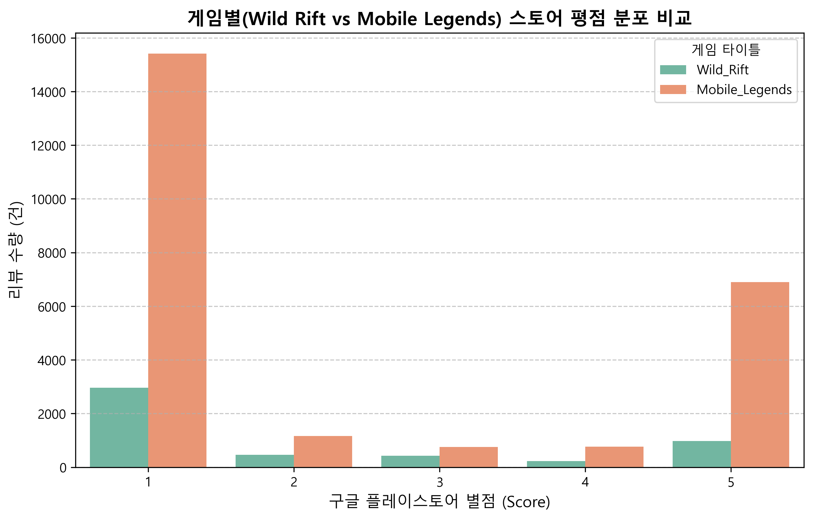
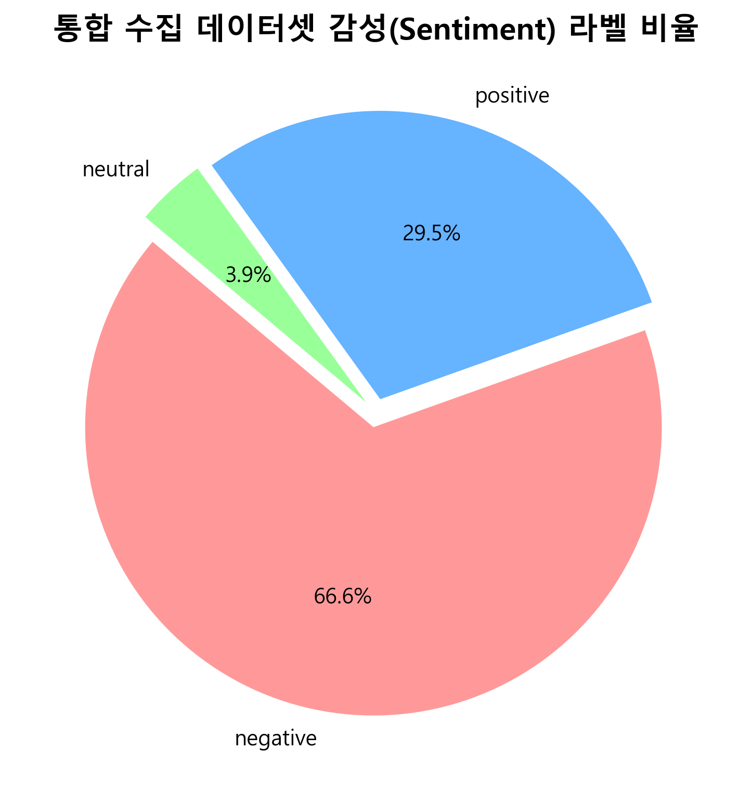
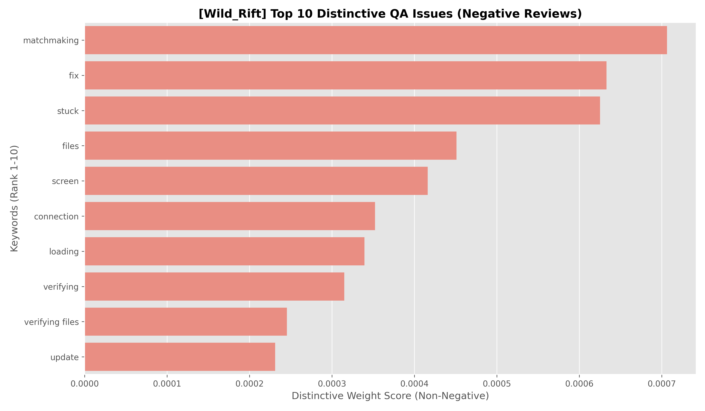
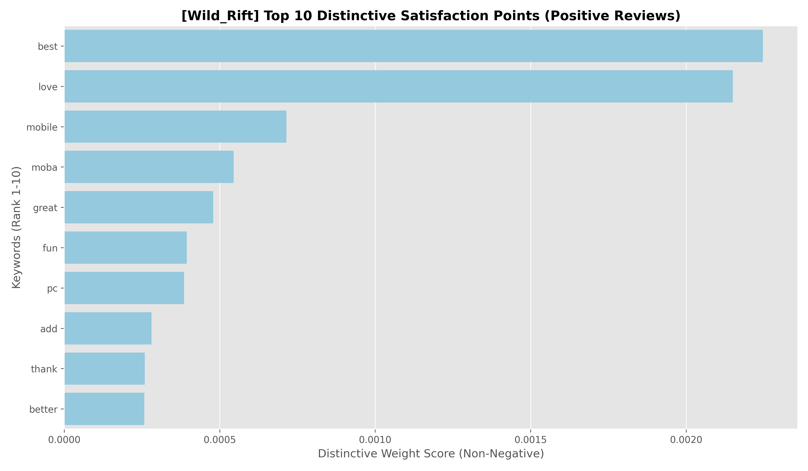
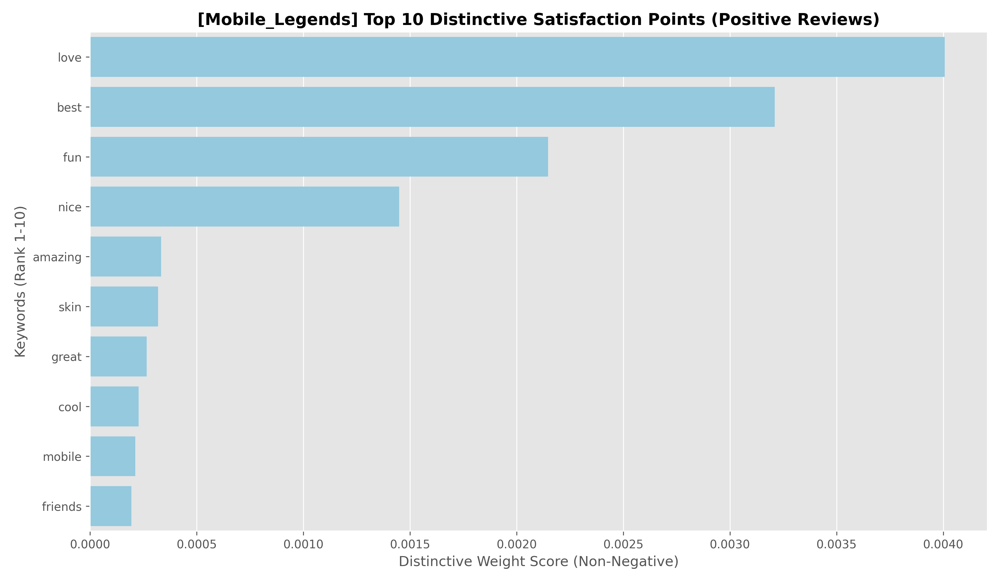
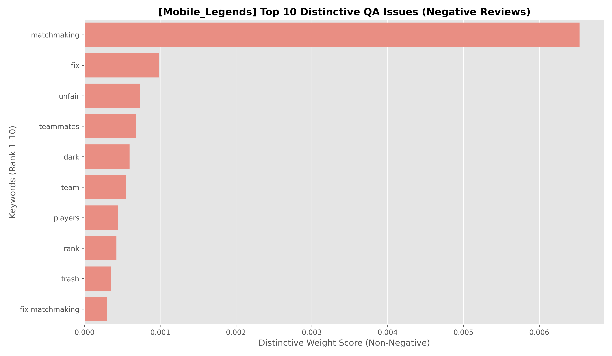
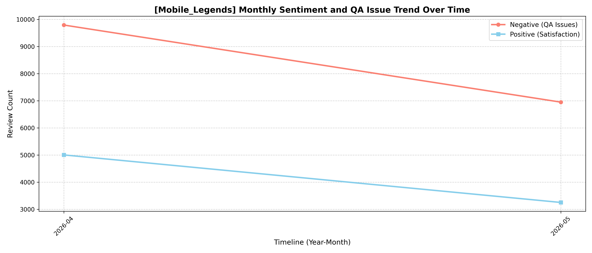
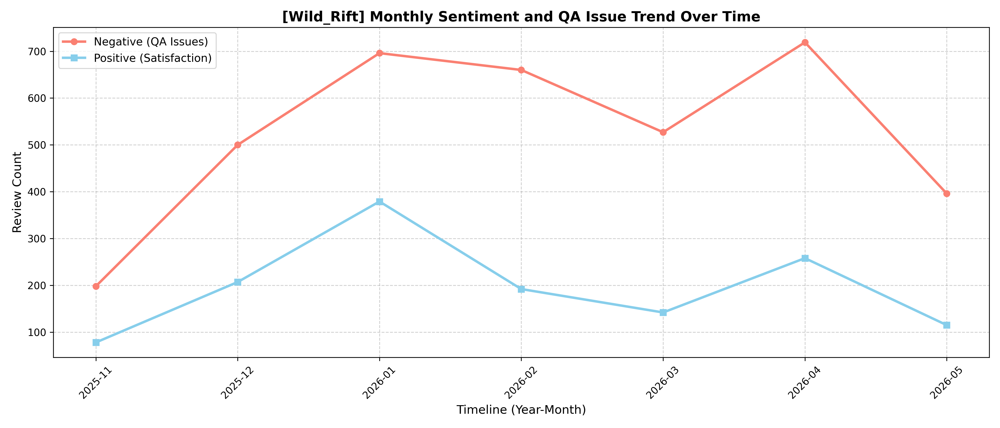
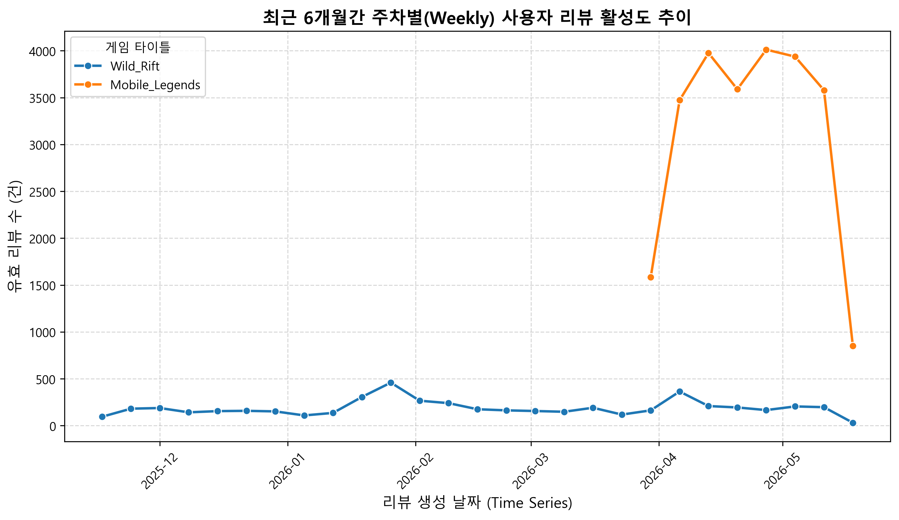

# MobileBERT 기반 US Google Play MOBA 게임 사용자 반응 비교 분석

---

### 1. 프로젝트 개요 설명

**[MOBA 장르의 특성과 라이브 서비스의 중요성]**
모바일 게임 시장에서 MOBA(Multiplayer Online Battle Arena) 장르는 실시간 5vs5 대전을 기반으로 하는 대표적인 하드코어 경쟁 장르다. 단순한 콘텐츠 소비형 게임과 달리, 실시간으로 변동하는 **영웅 간 밸런싱, 클라이언트 네트워크 안정성(Ping), 실력 기반 매칭 시스템(MMR), 시즌 운영(LiveOps)** 등의 요소가 유저 리텐션과 흥행 수명에 직결되는 특성을 보인다.

**[미국(US) 모바일 MOBA 시장의 경쟁 구도]**
현재 미국(US) 모바일 MOBA 시장에서는 Riot Games의 **League of Legends: Wild Rift**와 MOONTON의 **Mobile Legends: Bang Bang (MLBB)**이 양대 경쟁 구도를 형성하고 있다. 두 게임은 하드코어한 PC 원작의 모바일 이식(Wild Rift)과 모바일 환경에 맞춘 빠른 템포의 캐주얼한 접근성(MLBB)이라는 상이한 기획 방향성을 보이며, 이러한 차이는 유저들의 피드백 데이터에도 고스란히 나타난다.

**[분석 모델 및 연구 목표]**
본 프로젝트에서는 미국 Google Play Store의 두 게임 리뷰 데이터를 수집하여 사용자 반응을 비교 분석했다. 자연어 처리(NLP) 모델인 **MobileBERT**를 활용하여 영문 리뷰의 감성을 긍정·부정으로 이진 분류하고, 주요 키워드를 추출하여 게임별 만족 요인과 불만 요인을 탐색했다.

> **최종 목표:** 단순한 평점 통계 분석을 넘어, **기술 QA(Quality Assurance)와 라이브 운영(LiveOps) 관점**에서 실질적인 페인 포인트(Pain Point)를 추적한다. 이를 통해 게임 안정성 및 시스템 기획 요소가 사용자 경험(UX)에 미치는 영향을 데이터 기반으로 고찰한다.

---

### 2. 데이터 및 전처리 파이프라인

#### 2.1 데이터 수집 개요
미국(US) Google Play Store의 리뷰 데이터를 크롤링하여 누락 없는 데이터셋을 구축했다. 수집 과정에서 엔진 차단을 방지하기 위해 **Continuation Token 기반 분할 크롤링 구조**를 적용했다.

* **수집 대상:** 미국(US) 지역 `League of Legends: Wild Rift` 및 `Mobile Legends: Bang Bang` 유저 리뷰
* **수집 기간:** 2025년 11월 ~ 2026년 5월 (최근 6개월간의 라이브 데이터)
* **초기 원시 수집 규모:** 게임별 약 25,000건, 총 50,000건 이상

#### 2.2 데이터 정제 및 유효 데이터 확보
데이터의 신뢰성을 확보하기 위해 중복 데이터와 결측치를 제어하는 전처리 파이프라인을 진행했다.

1. **중복 및 결측치 제거:** 고유 `reviewId` 검증을 통한 중복 유입 차단 및 `content` 공백 데이터 제거
2. **단문 텍스트 필터링:** 의미 있는 정보가 부족한 **15자 미만**의 단문 리뷰 제외
3. **텍스트 무결성 검증:** 정규표현식(Regex)을 적용하여 특수문자, 이모지, 숫자만으로 구성된 무의미한 노이즈 데이터 삭제 (영문 알파벳이 포함되지 않은 리뷰)
4. **대소문자 통합 처리:** 동일 단어가 대소문자 차이로 분산 인지되는 현상을 방지하고자 가상 분석 컬럼(`content_lower`)을 추가하여 소문자 통일 적용

* **전처리 결과:** 과장되거나 무의미한 데이터를 정제하여 중복 및 결측 데이터 제거 후 <mark>유효 데이터 총 30,067건</mark> 확보의 성과를 거두었으며, 이를 기반으로 정밀 분석을 수행했다.

#### 2.3 탐색적 데이터 분석 (EDA) 및 토큰화 기획
유효 데이터셋의 통계 분포를 파악한 결과, 평점이 1점과 5점으로 쏠리는 전형적인 평점 양극화 현상이 나타났다. 또한 문장이 긴 장문 리뷰일수록 단순 감정 표출을 넘어 구체적인 기술 버그나 시스템 불만을 리포팅하는 성향이 두드러졌다.

특히 **Mobile Legends: Bang Bang (MLBB)**의 경우 1점에 쏠린 부정적 리뷰의 절대적인 수량이 Wild Rift를 압도하는 양상을 보인다. 문장이 긴 장문 리뷰일수록 단순 감정 표출을 넘어 구체적인 기술 버그나 시스템 불만을 리포팅하는 성향이 두드러졌다.

이를 효과적으로 포착하기 위해, 벡터라이저 설정 시 알파벳뿐만 아니라 모바일 게임 환경의 핵심 키워드인 **하드웨어 및 게임 기획 용어(`5v5`, `60fps`, `5g`, `ms`, `ui`, `mmr` 등)를 보존할 수 있도록 토큰 패턴 정규식을 `r'\b[a-zA-Z0-9]{2,}\b'` 체계로 확장**해 적용했다.

---

### 3. 학습 데이터 구축 및 무결성 검증

MobileBERT 모델의 정밀한 감성 경계 학습을 위해, 평점(Score) 데이터를 활용하여 이진 라벨을 자동 부여하는 약한 지도 학습(Weak Labeling)을 수행했다.

#### 3.1 별점 기반 자동 라벨링 규칙
* **긍정(Label 1):** 평점 4점 ~ 5점 (서비스 만족 유저)
* **부정(Label 0):** 평점 1점 ~ 2점 (시스템 결함 및 운영 불만 유저)
* **중립 데이터(3점) 제외:** 긍·부정의 경계가 모호하여 모델의 가중치 수렴을 방해하고 노이즈를 유발할 수 있는 3점 리뷰는 학습 및 검증 풀에서 배제해 데이터 분류의 정확도를 높였다.

#### 3.2 연구자 수동 검수(Manual Inspection)를 통한 라벨 정합성 검증
자동 라벨링 시스템이 지닌 수치와 맥락의 괴리를 검증하기 위해, 계층적 무작위 추출로 확보한 리뷰 100건을 대상으로 수동 검수 및 교정 작업을 진행했다.

* **수동 검수 결과 요약:** 총 100건의 교차 검증 중 5건의 라벨 오류를 포착해 정답셋으로 교정했다. **이를 통해 자동 라벨링의 정합성이 95%(불일치율 5%) 수준의 높은 신뢰도를 확보하고 있음을 확인했다.**

> **오분류 원인 분석 (Insight):** 별점 기반 라벨링의 5% 오분류 원인을 추적한 결과, 대부분 '기술적 결함 상황에서의 애정 어린 쓴소리' 패턴이었다. 유저들은 게임 자체에 대한 호감으로 평점은 4~5 만점을 부여하면서도, 본문 텍스트에는 "Unable to connect to server(서버 접속 불가)", "Black out and crash(화면 흑화 및 크래시)" 등 심각한 버그를 고발하며 조속한 조치를 요구했다. 자동 시스템은 이를 긍정으로 오판했지만, 수동 검토를 통해 문맥 중심의 부정(0) 라벨로 교정하여 데이터셋의 신뢰도를 보완했다.

---

### 4. MobileBERT 모델 파인튜닝 및 감성 추론 결과

모바일 및 엣지 디바이스 환경에 적합한 경량 자연어 처리 모델인 `google/mobilebert-uncased` 사전학습 모델을 Hugging Face 파이프라인과 PyTorch 프레임워크 기반 하에 파인튜닝했다.

#### 4.1 하이퍼파라미터 및 트러블슈팅
* **Epoch:** 과적합(Overfitting) 방지를 위해 `3`으로 지정
* **Batch Size:** 하드웨어 GPU 메모리 최적화 스케일링에 맞춰 `16` 적용
* **Max Length:** 문장 성분 손실 최소화를 위한 `128` 토큰 제한
* **트러블슈팅 (혼합 정밀도 fp16 충돌 해결):** 초기 연산 가속을 위해 fp16 모드를 가동했으나, 특정 도메인 토큰 레이어에서 Gradient Explosion 및 Loss NaN 현상이 발생하는 하드웨어 의존성 충돌을 발견했다. 이를 해결하기 위해 `fp16=False`로 전환하고 `learning_rate=2e-5` 설정을 통해 가중치 수렴의 안정성을 확보했다.

#### 4.2 최종 모델 평가 성능 및 추론 통계
약 14,000건의 검증 세트 기준 <mark>최종 정확도(Accuracy) 87.93%, F1-Score 87.45%</mark>의 성능을 확보했다. 데이터셋 내에 부정 리뷰의 비중이 높은 불균형이 존재함에도 불구하고, 정밀도(Precision)와 재현율(Recall)이 균형을 이룬 F1-Score 수치를 통해 모델이 안정적인 부정 리뷰 탐지 성능을 갖추었음을 증명했다. 특히 `AFK`(잠수), `Feed`(고의패배), `Smurf`(부캐학살) 등 장르 특유의 인게임 은어가 포함된 문맥을 효과적으로 포착하는 모습을 보였다.

학습 완료된 모델을 전처리 완료 유효 데이터 30,067건에 전면 배치를 적용하여 추론을 진행한 결과는 다음과 같다.

| 예측 감성 라벨 (Predicted Labels) | 집계 건수 (Review Count) | 비중 (%) |
|:---|:---|:---|
| **부정 (Negative - QA/LiveOps 불만)** | 20,441건 | **68.0%** |
| **긍정 (Positive - 콘텐츠 만족)** | 9,626건 | **32.0%** |
| **총합 (Total Valid Dataset)** | **30,067건** | **100.0%** |

부정 리뷰의 비중이 긍정 대비 2배 이상 높은 양상을 보인다. 이는 플레이어들이 게임에 만족할 때보다, 패배 스트레스를 겪거나 시스템 결함·운영 불만이 발생했을 때 훨씬 더 적극적으로 피드백을 남기는 MOBA 장르 특유의 유저 심리가 반영된 결과로 풀이된다.

---

### 5. 결과 및 고찰 (Results and Discussion)

단순 빈도 합산 방식의 한계를 극복하기 위해 본 프로젝트에서는 타겟 감성 그룹과 참조 감성 그룹의 평균 벡터 차이를 이용한 **상대 중요도 가중치 결합 공식**을 적용해 핵심 단어를 도출했다. 또한 데이터 일관성을 위해 단어 경계 정규식을 적용하여 리뷰 내의 `match making`, `match-making` 구조를 **`matchmaking`**이라는 단일 키워드로 통합했다.

$$\text{Distinctive Score} = \max((\text{Target}_{tfidf} - \text{Ref}_{tfidf}) \times \text{Target}_{tfidf}, \, 0)$$

#### 5.1 두 게임 간의 감성 및 키워드 구조 비교
전체 유효 데이터를 대상으로 연산을 수행한 결과, 두 게임은 상이한 유저 반응 구조를 보였다. 각 게임의 정량적 지표와 핵심 속성을 비교 요약한 결과는 다음과 같다.

| 비교 항목 | League of Legends: Wild Rift | Mobile Legends: Bang Bang (MLBB) |
| :--- | :--- | :--- |
| **주요 감성 분포** | 부정 약 59% / 긍정 약 41% | 부정 약 68% / 긍정 약 32% |
| **핵심 부정 키워드** | `high ping`, `fps drop`, `crash`, `lag` | `matchmaking`, `unfair`, `teammates`, `dark` |
| **핵심 긍정 키워드** | `pc`, `graphics`, `league`, `controls` | `fast match`, `easy`, `skins`, `friends` |
| **주요 불만 영역** | 네트워크 안정성 및 기기 최적화 | 매칭 알고리즘 밸런스 및 유저 제재 |
| **분석 관점 분리** | **기술 QA (Technical QA)** 중심 불만 | **라이브 운영 (LiveOps)** 중심 불만 |

#### 5.2 League of Legends: Wild Rift 분석 결과 및 해석
Wild Rift 유저들의 주요 불만 요인은 네트워크 및 기기 최적화 측면에 집중되는 양상을 보였다.

* **부정 리뷰 주요 키워드:** `high ping`, `fps drop`, `crash`가 최상위권을 차지했다.

* **긍정 리뷰 주요 키워드:** 원작 지표인 `pc`와 시각 요소인 `graphics`의 상대적 가중치가 높게 나타났다.

* **해석:** Wild Rift는 PC 원작의 리소스를 높은 수준으로 모바일 이식하여 시각적 품질과 원작 재현성 면에서 만족을 주는 것으로 보인다. 반면 하이엔드 그래픽 사양 요구로 인해 디바이스 파편화 대응 및 핑(Ping) 안정성 확보에는 취약한 모습을 보인다. 하드웨어 성능을 높게 요구하는 게임 구조가 기술 QA 영역의 페인 포인트로 작용하고 있음을 보여준다.

#### 5.3 Mobile Legends: Bang Bang (MLBB) 분석 결과 및 해석
MLBB 유저들의 부정적 반응은 기술적 결함보다 게임 디자인 및 라이브 운영 시스템에 집중되는 특성을 보였다.
* **긍정 리뷰 주요 키워드:** 바일 최적화 편의성과 매력적인 `skin`, 친구와 함께하는 `friends` 플레이의 가중치가 높게 나타났다..

* **부정 리뷰 주요 키워드:** `matchmaking`, `unfair`, `teammates`, `dark` 키워드가 압도적인 가중치 점수를 기록했다.

* **해석:** 오랜 라이브 서비스 기간 축적된 경쟁 시스템을 운영 중인 MLBB는 클라이언트 크래시보다 실력 기반 매칭 시스템(MMR 알고리즘)의 불균형에 유저들이 더 민감하게 반응하는 양상을 보였다. 특히 불공정 매치를 뜻하는 인게임 은어인 `dark`(Dark System)나 극단적 불만 표현이 상위에 노출된 것은 유저들이 체감하는 팀원 실력 격차 스트레스가 높은 수준임을 보여준다. 이는 시스템 기획 및 라이브 운영(LiveOps) 관점의 매칭 로직 개선이 필요한 시점임을 말해준다.

#### 5.4 긍정 리뷰의 유저 행동 패턴 공통점 및 차이점
두 게임 모두 긍정 리뷰의 최상위권은 `love`, `best`, `fun` 등 일반적인 감탄사 위주의 단문 표현이 지배적인 성향을 보였다.

* **유저 행동 패턴 해석:** 이는 데이터 정제 과정의 한계라기보다 유저의 실제 행동 특성이 반영된 결과다. MOBA 장르 유저들은 만족스러운 게임 경험을 했을 때 시스템 요소를 구체적으로 상술하기보다는, 'love', 'best'와 같은 간결한 표현을 남긴 후 빠르게 인게임으로 복귀하는 성향을 보이기 때문이다.
* **차별적 장점 해석:** 감탄사를 제외한 중하위권 키워드에서 차이가 나타났다. Wild Rift는 `pc`, `graphics`가 포착되어 플랫폼 이식도에 대한 만족을 드러낸 반면, MLBB는 `fast match`, `friends`가 도출되었다. 이는 MLBB 유저들이 빠른 접근성과 소셜 플레이(지인 협동) 환경에 가치를 두고 있음을 보여준다.

---

### 6. 시계열 감성 트렌드 분석 (Time-Series Analysis)

시간 흐름에 따른 유저 여론 추이를 관찰하고자, 구글 플레이스토어 날짜 타임스탬프인 `at` 컬럼을 월별 단위로 집계하여 시계열 분석을 진행했다. 데이터 볼륨이 큰 MLBB를 기준으로 2026년 4월과 5월의 감성 추이를 추적한 결과는 다음과 같다.

#### 6.1 월별 감성 추이 집계 결과
* **2026-04:** 부정 9,794건 / 긍정 5,004건 (부정 비중 66.19%)
* **2026-05:** 부정 6,951건 / 긍정 3,251건 (부정 비중 68.13%)

  
* Wild Rift의 6개월 시계열 라인 차트를 분석한 결과, 기술 QA 및 유저 행동 패턴 관점에서 다음과 같은 핵심 인사이트를 도출했다.
**[League of Legends: Wild Rift]**
* **2025-11:** 부정 198건 / 긍정 78건 (부정 비중 <mark>71.74%</mark>)
* **2025-12:** 부정 500건 / 긍정 207건 (부정 비중 <mark>70.72%</mark>)
* **2026-01:** 부정 696건 / 긍정 379건 (부정 비중 <mark>64.74%</mark>)
* **2026-02:** 부정 660건 / 긍정 192건 (부정 비중 <mark>77.46%</mark>)
* **2026-03:** 부정 527건 / 긍정 142건 (부정 비중 <mark>78.77%</mark>)
* **2026-04:** 부정 719건 / 긍정 258건 (부정 비중 <mark>73.59%</mark>)
* **2026-05:** 부정 396건 / 긍정 115건 (부정 비중 <mark>77.50%</mark>)

* 시각화 해석 요약: 
* 1. **만성적 부정 우세:** 전 기간에 걸쳐 부정 피드백이 최소 64%에서 최대 78%까지 치솟으며 긍정 피드백을 만성적으로 압도함.
  2. **업데이트 스파이크 현상:** 대규모 패치 및 시즌 리셋이 집중되는 **2026-01**과 **2026-04** 시점에 결함 리포팅 트래픽이 폭발적으로 증가하는 양상을 보임.
  3. 통합 데이터 
#### 6.2 시계열 분석 기반의 라이브 서비스 고찰
* **데이터 최신성 반영:** 4월 대비 5월의 절대적 리뷰 수량이 감소한 양상을 보인다. 이는 데이터 유실이 아니라, 데이터 추출 시점이 2026년 5월 말이기 때문이다. 즉, 한 달 전체 일수가 온전히 채워지지 않은 상태에서 실시간 라이브 피드백이 반영된 결과로 풀이된다.
* **분류 안정성 및 여론 트렌드:** 데이터의 절대적 총량 변동에도 불구하고, 긍정과 부정의 분포 비율은 약 2:1 구조를 유지하며 일정하게 수렴하는 경향을 보였다. 이는 감성 예측 모델의 분류 강건성을 입증하는 지표다.
* **운영적 시사점:** 리뷰 총량이 감소한 환경에서도 부정 여론의 비중(68.13%)이 견고하게 유지된다는 점에 주목할 만하다. 앞서 도출된 매칭 시스템 결함이나 악성 유저 방치 등의 페인 포인트가 특정 시점의 단발성 이슈가 아님을 확인할 수 있다. 즉, 유저 경험을 만성적으로 저해하는 게임 내 구조적 결함이 지속되고 있다는 방증이다.

---

### 7. 느낀점 및 향후 개선 방향

**[프로젝트 수행 간 느낀점]**
* **도메인 데이터 무결성의 중요성:** 단순 텍스트 처리가 아닌 `token_pattern` 조율을 통해 `60fps`, `ui` 같은 핵심 QA 신호를 살려내는 과정에서 도메인 지식과 데이터 마이닝 기법이 결합했을 때의 가치를 체감했다.
* **해석적 정직함의 중요성:** 데이터 분석 결과를 인위적으로 가공하기 위해 무리한 노이즈 깎아내기 기법에 집착하는 것보다, 데이터가 가진 쏠림 현상과 분포 차이 자체를 유저 행동 패턴(User Behavior)의 맥락으로 정직하게 해석해 낼 때 보고서의 설득력이 더욱 견고해짐을 깨달았다.

**[향후 고도화 및 개선 연구 방향]**
* **속성 기반 감성 분석(ABSA)으로의 진화:** 한 문장 내에 공존하는 "그래픽은 좋으나 핑이 튄다"와 같은 피드백을 세부 속성별로 쪼개어 감성 스코어를 부여하는 레이어 고도화를 추진할 계획이다.
* **LLM 연계형 LiveOps 자동화 리포팅 파이프라인 구축:** TF-IDF 상대 중요도로 도출된 실시간 마스터 CSV 테이블 구조(`Rank`, `Keyword`, `Score`, `Sentiment`, `Game`)를 GPT/Gemini API의 프롬프트와 연동하여, 라이브 서비스 팀과 QA 팀이 즉각적으로 모니터링할 수 있는 결함 요약 리포트 자동 생성 파이프라인을 구축하고자 한다.