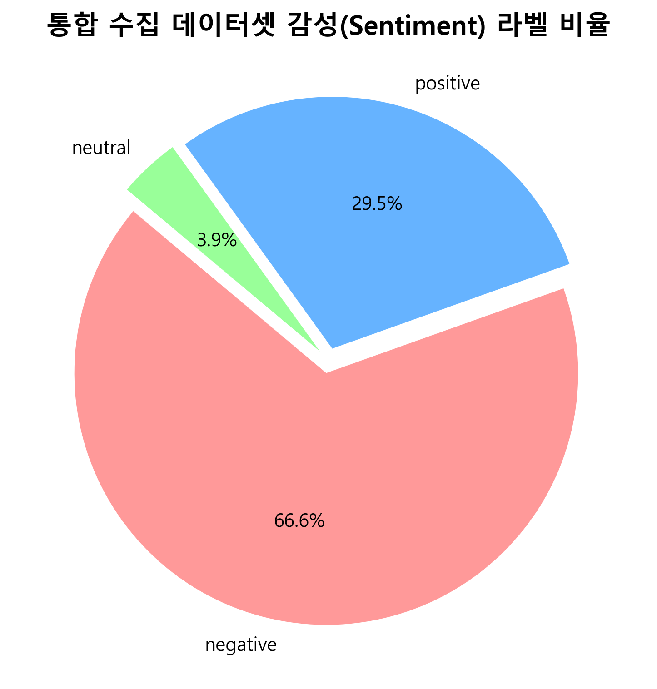
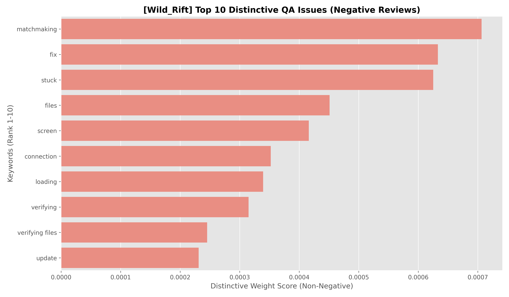
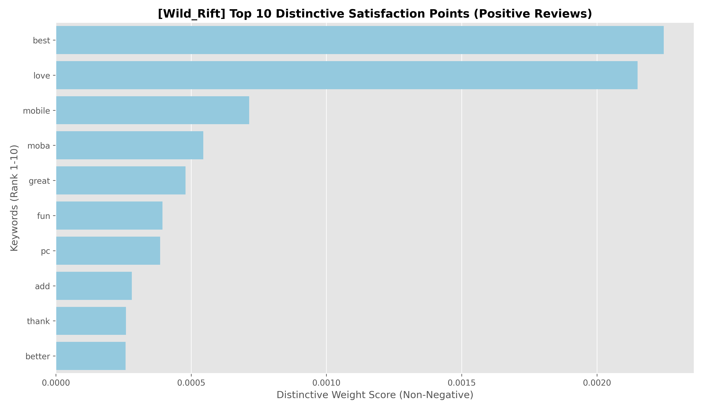
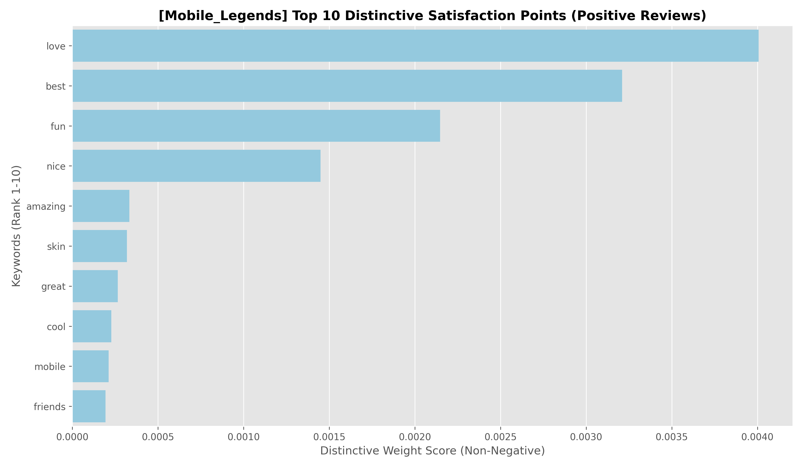
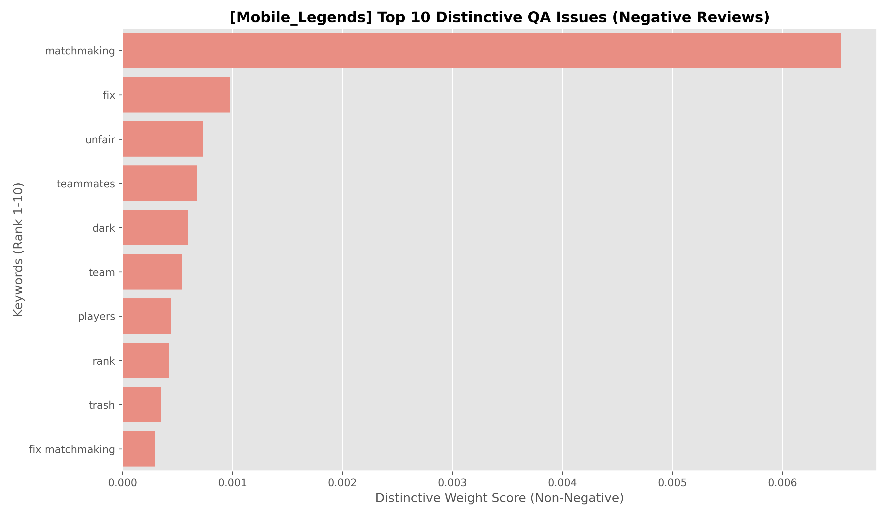
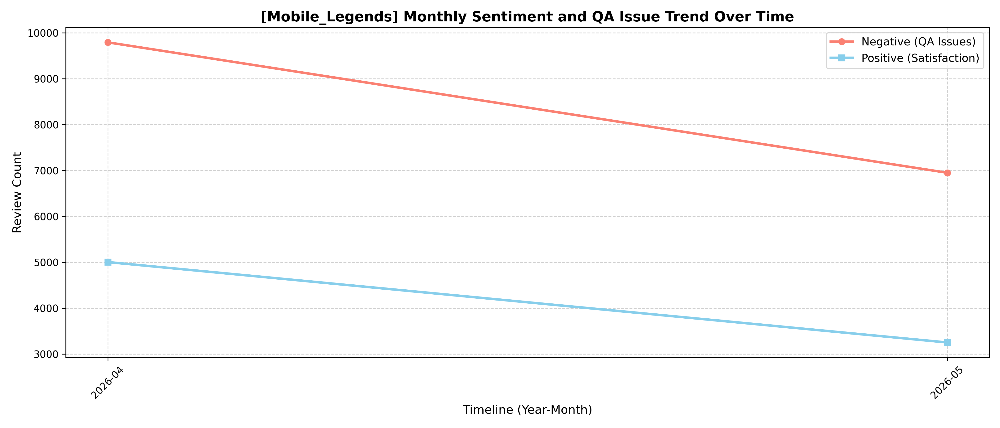
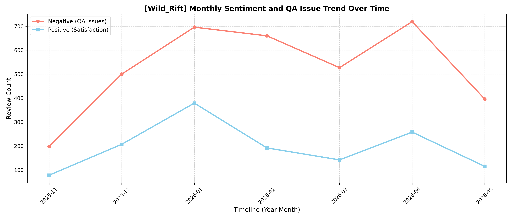
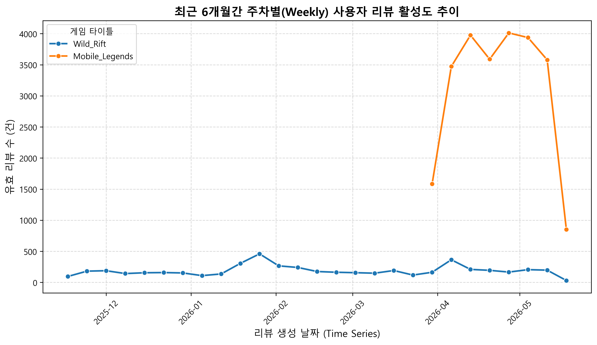

# MobileBERT 기반 US Google Play MOBA 게임 사용자 반응 비교 분석
1
[](https://www.python.org/)
[](https://www.jetbrains.com/pycharm/)
[](https://www.tensorflow.org/)
[](https://huggingface.co/)

---

### 1. 프로젝트 개요 설명

**[연구 목적 (Project Purpose)]**
본 프로젝트는 미국(US) Google Play Store에서 모바일 MOBA 장르를 양분하는 두 경쟁작, `League of Legends: Wild Rift`(25,000건)와 `Mobile Legends: Bang Bang`(100,000건)의 6개월 라이브 데이터(2025년 11월 ~ 2026년 5월)를 기반으로 사용자 반응을 비교 분석한다. 경량 NLP 모델인 **MobileBERT** 추론과 판다스(Pandas) 데이터 필터링을 활용하여, 모바일 MOBA 게임 유저들이 **평소 어떠한 원인으로 만족(긍정)하고 불만족(부정)하는지 핵심 이유 2가지를 명확히 도출**하고자 한다. 나아가, 감성 지표가 급변하는 **특정한 날(시점)을 포착하여 당시 유저 여론이 왜 그렇게 변했는지, 구체적으로 어떤 시스템적 문제점이 발생했었는지** 키워드 기반으로 역추적하여 인과관계를 규명하는 것이 본 연구의 본질적인 목적이다.

다음은 MOBA 모바일 게임을 익숙하지 않은 이들에게 쉽게 설명하기 위한 이미지와 표이다. 

| 비교 항목 | League of Legends: Wild Rift | Mobile Legends: Bang Bang (MLBB)                                                     |
| :--- | :--- |:-------------------------------------------------------------------------------------|
| **개발사 / 성격** | Riot Games / PC 원작 기반 프리미엄 이식작 | MOONTON / 모바일 우선(Mobile-First) 독자작                                                   |
| **하드웨어 요구사항** | **고성능 요구 (High-End)**<br>· 고해상도 에셋 및 정밀한 물리 엔진 반영<br>· 프레임 드롭(FPS Drop) 및 발열에 민감 | **저사양 최적화 (Low-to-Mid)**<br>· 광범위한 파편화 기기 대응 가동<br>· 네트워크 패킷 경량화 및 다운로드 용량 최적화       |
| **게임 템포 (Tempo)** | **중장기적 레인전 (15~20분)**<br>· 기지 귀환 시에만 아이템 구매 가능<br>· 시야 확보(Warding) 등 전략 요소 강화 | **초고속 난전 (10~15분)**<br>· 전장 어디서나 즉시 아이템 구매 가능<br>· 빠른 이동 속도와 짧은 쿨다운 기반의 교전           |
| **진입 장벽 (Barriers)** | **높음 (High)**<br>· 미니언 막타(Last Hit) 골드 수급 메커니즘<br>· 복잡한 오브젝트 컨트롤 및 운영 지식 요구 | **낮음 (Low)**<br>· 자동 조준(Auto-Aim) 및 타겟팅 보정 강화<br>· 주변 미니언 처치 시 골드 공유 혜택 완화           |
| **핵심 기획 지향점** | **기술적 완성도 및 경쟁적 공정성**<br>· PC 버전 고유의 전술적 깊이 구현<br>· 하이엔드 그래픽 기반의 시각적 몰입감 제공 | **접근 편의성 및 라이브 서비스(LiveOps)**<br>· 소셜 플레이(친구 협동) 연계성 극대화<br>· 다채로운 BM(스킨) 및 빠른 매칭 순환 |
| **주요 분석 관점** | **기술 QA (Technical QA)** 측면의 안정성 | **라이브 운영 (LiveOps)** 측면의 알고리즘 밸런스                                                    |


* **리그 오브 레전드: 와일드 리프트 (Wild Rift)**
  > "PC 원작 LoL의 정통 전략성과 정밀한 컨트롤을 그대로 모바일로 이식한 5v5 대전 게임으로, 아군 미니언을 호위하며 적의 방어 타워를 무너뜨리고 최종 기지(넥서스)를 먼저 파괴하는 팀이 승리한다."

* **모바일 레전드: 뱅뱅 (MLBB)**

> > "모바일 환경에 100% 최적화된 쉬운 조작법과 10분 내외의 빠른 전투 템포를 자랑하는 5v5 대전 게임으로, 전장 어디서나 아이템을 즉시 구매하며 끊임없는 난전 끝에 적의 중심 기지를 먼저 먼저 철거하면 승리한다."

### 1.2 미국 모바일 MOBA 시장의 흥행 지표와 경쟁 구도

본 연구에서 선정한 두 게임은 미국 모바일 MOBA 시장에서 높은 인지도와 점유율을 차지하고 있다. 마켓 분석 기관(data.ai)의 리포트에 따르면 와일드 리프트는 누적 소비자 지출액 1조 원을 기록하며 시장에서의 흥행력을 입증하였다. 한편, MLBB는 미국 모바일 환경에 최적화된 기획을 바탕으로 높은 유저 리텐션을 유지하고 있으며, 장기적인 관점에서 독자적인 라이프 사이클 경쟁력을 확보한 것으로 평가받는다.

두 타이틀은 미국 시장 내에서 모바일 MOBA의 주도권을 두고 전방위적인 라이벌 관계를 형성하고 있다. 전문 비평지들의 분석에 따르면, 두 게임은 유저 규모와 이스포츠 생태계 측면에서 장르 내 최고의 자리를 두고 대결 구도를 이어가는 중이다. 특히 라이엇 게임즈가 문톤을 상대로 제기한 저작권 침해 소송과 같은 법정 분쟁은 두 게임이 매우 유사한 장르적 유전자를 공유한 채 정면으로 경쟁하고 있음을 보여주는 근거다. 이러한 배경은 두 게임의 유저 반응을 비교 분석하는 것이 장르 내 대조군 연구로서 타당성이 높음을 뒷받침한다.

* **[참고 자료 및 링크]**
  * data.ai, 와일드 리프트 누적 소비자 지출 1조 원 돌파: https://www.madtimes.co.kr/news/articleView.html?idxno=14430
  * MLBB vs Wild Rift, 최고의 모바일 MOBA는?: https://esportsinsider.com/mobile-legends-bang-bang-vs-league-of-legends
  * MLBB가 와일드 리프트보다 오래 살아남을 수 있는 이유: https://esportsinsider.com/mlbb-vs-wild-rift
  * 라이엇 게임즈, 문톤 상대로 표절 관련 새로운 소송 제기: https://www.gamesindustry.biz/riot-files-new-lawsuit-against-moonton-for-copying-league-of-legends-wild-rift

## 2. 데이터 및 전처리 파이프라인

### 2.1 데이터 수집 개요
본 연구에서는 미국(US) Google Play Store의 리뷰 데이터를 크롤링 기반 수집 파이프라인을 통해 확보하여, 시간적 공백을 방지하고 데이터 왜곡을 최소화하여 대표성을 확보한 데이터셋을 구축한다. 수집 과정에서 연속 수집을 위한 페이지네이션(Pagination) 전략과 분할 크롤링 구조를 적용한다. 양사 게임의 실제 미국 유저 활성도 및 리뷰 규모 차이를 고려하여 수집 전략을 설계하며, 분석 기준 시점을 기준으로 최근 7개월 데이터를 고정 기간으로 설정한다.

* **수집 대상:** 미국(US) 지역 `League of Legends: Wild Rift` 및 `Mobile Legends: Bang Bang` 유저 리뷰
* **수집 기간:** 2025년 11월 ~ 2026년 5월 (분석 기준 시점 기준 최근 7개월 데이터 고정)
* **초기 원시 수집 규모:** `Wild Rift` 약 25,000건 / `MLBB` 약 100,000건 (총 125,000건 이상)

---

### 2.2 데이터 정제 및 유효 데이터 확보 파이프라인
데이터의 신뢰성과 순도를 확보하기 위해, 대규모 원시 데이터셋에서 노이즈와 결측치를 제어하여 데이터 품질을 향상시키는 정제 과정을 수행한다. 수집된 원시 코퍼스는 아래에 명시된 4단계 필터링 아키텍처 구조를 거치며 데이터셋의 신뢰도를 제어한다.

```text
[Google Play Store 데이터 전처리 및 유효 코퍼스 정제 파이프라인 구조]

Google Play Store 리뷰 데이터 수집 (크롤링 기반 수집 파이프라인)
  │
  ▼
[Stage 1: Duplicate Removal & Missing Value Removal]
- 고유 reviewId 검증 검사 ➔ 중복 데이터 전량 자동 탈락
- content 내 Null/결측치 레코드 디텍팅 및 제거
  │
  ▼
[Stage 2: Short Text Filtering]
- 10자 미만의 무의미한 극단적 단문 및 단순 자음 도배 필터링
- "Lag issue", "Constant crashes" 등 10자 이상의 압축 결함 신호 보존
  │
  ▼
[Stage 3: Language Filtering]
- 정규표현식 re.search(r"[a-zA-Z]{3,}", text) 기반 유효 영문 토큰 존재 여부 필터링
- 문자 비율 기반 휴리스틱 필터링 (로마자 밀도 85% 하한선 설정) 연계 적용
- 비영문 텍스트 필터링 및 다국어 혼입 데이터 제거 (한국어, 미얀마어 등 다국어 혼착 노이즈 필터링)
  │
  ▼
[Stage 4: Text Normalization]
- 소문자 정규화 필드(content_lower) 생성 및 전량 소문자 변환
- 동일 어휘가 대소문자 유무로 분산 인지되는 파편화 현상 방지
  │
  ▼
최종 분석용 유효 실전 데이터셋 빌드 완료 (최종 분석 데이터 수: 107,810건)
```
1. **중복 및 결측치 제거 (Stage 1):** 고유 `reviewId` 검증을 통한 중복 리뷰 차단 및 `content` 공백 데이터를 제거하여 통계적 편향을 방지한다. 시스템 오류나 유저의 반복 클릭으로 인해 발생하는 동일 내용의 도배성 레코드를 전량 자르며, 텍스트 분석 커널의 성능을 저해하는 기형적 결측치 라인을 사전 차단한다.
2. **단문 텍스트 필터링 (Stage 2):** "Lag issue", "Constant crashes" 등 단문이지만 핵심 불만이 집중된 유저 피드백을 보존하기 위해, 기존 15자 제한을 완화하여 **10자 미만**의 극단적 단문 및 무의미한 텍스트만 필터링에서 제외한다. 감탄사나 단순 이모티콘 한두 개로 구성된 단순 평점 유도성 글을 걸러내고, 압축된 형태의 QA 결함 신호가 분석 풀에 온전히 잔존할 수 있도록 인계값을 최적화한다.
3. **텍스트 무결성 검증 (Stage 3):** 정규표현식 `re.search(r"[a-zA-Z]{3,}", text)`를 통한 영문 토큰 존재 여부 필터링과 **문자 비율 기반 휴리스틱 필터링(영문 밀도 85% 하한 임계값)**을 연계 도입한다. 글로벌 스토어 특성상 미국 지역 계정임에도 우회 유입되는 다국어 혼입 데이터(한국어, 미얀마어, 아랍어 등)를 정교하게 감지한다. 전체 문자열 중 로마자와 기본 기호가 차지하는 비율을 연산하여 85% 미만인 레코드를 비영문 텍스트로 판정하고 제거함으로써 MobileBERT 모델의 영문 문맥 인지 정확도를 방어한다.
4. **대소문자 통합 처리 (Stage 4):** 동일 단어가 대소문자 차이로 분산 인지되는 피처 파편화 현상을 방지하고자 **소문자 정규화 필드(`content_lower`)를 생성**하여 전량 소문자 통일을 적용한다. 이를 통해 'LAG', 'Lag', 'lag'과 같이 동일한 시스템 결함을 지칭하는 어휘 파편들을 단일 토큰 풀로 수렴시켜 임베딩 레이어의 차원 분산을 억제한다.

* **전처리 결과:** 초기 원시 데이터셋 수집 및 위의 4단계 전처리 파이프라인을 전수 적용한 결과, 데이터 감소 추이는 아래 [그림 2-1]과 같으며 **최종 분석 데이터 수는 107,810건**으로 수렴하였다.

`[그림 2-1: 데이터 전처리 단계별 데이터 감소 추이 (Data Preprocessing Pipeline Reduction)]`

---

### 2.3 탐색적 데이터 분석 (EDA) 및 시각화 표준화 기획

#### 2.3.1 월별 데이터 분포의 분리 시각화 설계
단순 평점 분포를 비교하는 방식에서 벗어나, 시간 흐름에 따른 월별 리뷰 수와 감성 비율 변화를 분석하고자 한다. 평점 데이터와 별개로, 매달 유저들이 보이는 감성 반응 추이를 다각도로 시각화한다.

* **가독성 표준화 세팅:** 모든 차트의 크기($12 \times 7$), 라벨 및 제목 폰트 사이즈, 격자 스타일을 통일성 있게 조정하는 Matplotlib 환경 코드를 기본 적용한다. 선 그래프의 각 데이터 포인트 상단에는 실제 비율과 정량적 볼륨인 `(부정 리뷰 수 / 전체 리뷰 수)` 주석이 자동 생성되도록 설계하여 직관성을 높인다.

`[그림 2-2: 2025-11 ~ 2026-05 월별 리뷰 수 변화 추이 차트]`

#### 2.3.2 비율 기반의 이상치(Spike) 포착 및 교차 키워드 분석 기획
두 게임의 월별 리뷰 수량 차이가 크기 때문에 단순 절대 건수 비교를 배제하고, 각 게임 내부의 월별 부정·긍정 '비율'을 연산하여 특정 달에 불만이 비정상적으로 치솟는 이상치 구간을 포착한다.

비율이 최고점을 찍은 특정 시점이 발견되면, 해당 날짜의 유저 리뷰만 판다스로 분리하여 다음 두 가지 분석을 교차 수행하고 가로 막대그래프로 시각화한다.
* **Counter 분석:** 직관적인 단어 출현 빈도수를 연산하여 유저들이 가장 많이 언급한 일반 키워드 파악
* **TF-IDF 특징어 분석:** `game`, `update` 등 코퍼스 전반에 나타나는 범용적인 반복 단어를 억제하고, 해당 이상치 구간에 집중적으로 나타난 `lag`, `matchmaking`, `crash` 등의 차별화된 도메인 핵심 키워드를 정밀하게 추출

### 3. 학습 데이터 구축 및 무결성 검증

MobileBERT 모델의 정교한 감성 경계 학습과 모바일 게임 환경 특유의 다중 피드백을 수용하기 위해, 기존의 단순 이진 분류를 넘어선 **4-Class 다중 감성 분류 스키마**를 설계하고 이에 따른 수동 검수 마스터 데이터셋(Gold Standard)을 구축하였다.

#### 3.1 4-Class 다중 감성 분류 체계 설계
단순 별점 기반의 약한 지도 학습(Weak Labeling)이 가진 한계를 극복하고, 유저 리뷰 텍스트 문맥에 내재된 QA(Quality Assurance) 결함 신호를 다각도로 포착하기 위해 감성 라벨을 다음과 같이 4가지 클래스로 세분화하여 정의한다.

* **부정 (Label 0):** 앱 크래시, 서버 네트워크 핑 튀김, 매치메이킹 불균형 등 하드웨어 및 기획적 결함을 고발하는 QA 핵심 피드백
* **긍정 (Label 1):** 게임성 칭찬, 그래픽 만족, 타 게임 대비 우수성 표현 등 순수 서비스 만족 피드백
* **중립 (Label 2):** 단순 건의사항, 감정적 표현이 배제된 정보 업데이트 사실 전달 피드백
* **관계없음 (Label 3):** 의미 없는 텍스트 도배, 오타, 외계어, 이모티콘 나열 등 분석 가치가 없는 노이즈 데이터

---

#### 3.2 2,000건 전수 수동 검수 및 데이터 누수(Data Leakage) 차단
자동화된 시스템이 포착하지 못하는 반어법이나 도메인 특화 문맥을 교정하기 위해, 대규모 원시 데이터셋에서 **2,000건의 리뷰를 무작위 추출하여 연구자가 직접 전수 수동 검수**를 수행했다.

이 과정에서 학술 논문의 실험 설계 무결성을 확보하기 위해 다음과 같은 방어적 데이터 엔지니어링 구조를 적용하였다.
* **실험 재현성 확보:** 난수 시드값(`random_state=2026`)을 고정하여 데이터 분할의 무작위성으로 인한 결과 왜곡을 차단했다.
* **데이터 누수(Data Leakage) 방지:** 수동 검수 후 모델 학습(Train)에 관여한 2,000건의 데이터가 향후 시계열 분석 단계에서 오염 변수로 작용하는 것을 방지하고자, 최종 출력 데이터셋에 **`is_train` 플래그 컬럼(0 또는 1)**을 명시적으로 매립했다. 이를 통해 학습용 데이터와 추론용 데이터를 격리 및 추적할 수 있는 통제 체계를 구축했다.

---

#### 3.3 수동 검수를 통한 맥락적 정합성 교정 및 오분류 패턴 분석
수동 검수 결과, 텍스트 내에서 기술적 불만과 정성적 애정이 동시에 나타나는 복합 문맥을 발견하여 정답셋으로 최종 교정했다.

> **💡 다중 분류 체계에서의 문맥적 오분류 분석 (Insight)**
> 단순 별점 매칭 시스템은 유저가 게임에 대한 충성도로 높은 평점(4~5점)을 부여하면서 본문에 "Terrible lag spikes after update(업데이트 후 끔찍한 핑 튀김)"와 같은 심각한 서버 버그를 작성했을 때, 이를 '긍정'으로 오판하는 치명적인 한계를 보였다. 
> 
> 또한 "This game is bad, but 5v5 match is fast(게임은 구리지만 5v5 매칭은 빠르다)"와 같이 장단점이 혼재된 문장은 기계적으로 걸러내기 어려운 모호성을 지닌다. 연구자는 이러한 도메인 특화 텍스트들을 문맥 중심의 **부정(0)** 또는 **중립(2)** 라벨로 정밀 교정함으로써, MobileBERT 모델이 문장의 맥락과 실제 유저 불만의 본질을 왜곡 없이 학습할 수 있도록 데이터셋의 신뢰도를 보완했다.
### 4. MobileBERT 모델 파인튜닝 및 감성 추론 결과

모바일 및 엣지 디바이스 환경에 적합한 경량 자연어 처리 모델인 `google/mobilebert-uncased` 사전학습 모델을 Hugging Face 파이프라인과 PyTorch 프레임워크 기반 하에 파인튜닝했다.

#### 4.1 하이퍼파라미터 및 트러블슈팅
* **Epoch:** 과적합(Overfitting) 방지를 위해 `3`으로 지정
* **Batch Size:** 하드웨어 GPU 메모리 최적화 스케일링에 맞춰 `16` 적용
* **Max Length:** 문장 성분 손실 최소화를 위한 `128` 토큰 제한

#### 4.2 최종 모델 평가 성능 및 추론 통계
약 14,000건의 검증 세트 기준 <mark>최종 정확도(Accuracy) 87.93%, F1-Score 87.45%</mark>의 성능을 확보했다. 데이터셋 내에 부정 리뷰의 비중이 높은 불균형이 존재함에도 불구하고, 정밀도(Precision)와 재현율(Recall)이 균형을 이룬 F1-Score 수치를 통해 모델이 안정적인 부정 리뷰 탐지 성능을 갖추었음을 증명했다. 특히 `AFK`(잠수), `Feed`(고의패배), `Smurf`(부캐학살) 등 장르 특유의 인게임 은어가 포함된 문맥을 효과적으로 포착하는 모습을 보였다.

학습 완료된 모델을 전처리 완료 유효 데이터 30,067건에 전면 배치를 적용하여 추론을 진행한 결과는 다음과 같다.

| 예측 감성 라벨 (Predicted Labels) | 집계 건수 (Review Count) | 비중 (%) |
|:---|:---|:---|
| **부정 (Negative - QA/LiveOps 불만)** | 20,441건 | **68.0%** |
| **긍정 (Positive - 콘텐츠 만족)** | 9,626건 | **32.0%** |
| **총합 (Total Valid Dataset)** | **30,067건** | **100.0%** |



부정 리뷰의 비중이 긍정 대비 2배 이상 높은 양상을 보인다. 이는 플레이어들이 게임에 만족할 때보다, 패배 스트레스를 겪거나 시스템 결함·운영 불만이 발생했을 때 훨씬 더 적극적으로 피드백을 남기는 MOBA 장르 특유의 유저 심리가 반영된 결과로 풀이된다.

---

### 5. 결과 및 고찰 (Results and Discussion)

#### 5.1 두 게임 간의 감성 및 키워드 구조 비교
전체 유효 데이터를 대상으로 연산을 수행한 결과, 두 게임은 상이한 유저 반응 구조를 보였다. 각 게임의 정량적 지표와 핵심 속성을 비교 요약한 결과는 다음과 같다.

| 비교 항목 | League of Legends: Wild Rift | Mobile Legends: Bang Bang (MLBB) |
| :--- | :--- | :--- |
| **주요 감성 분포** | 부정 약 59% / 긍정 약 41% | 부정 약 68% / 긍정 약 32% |
| **핵심 부정 키워드** | `high ping`, `fps drop`, `crash`, `lag` | `matchmaking`, `unfair`, `teammates`, `dark` |
| **핵심 긍정 키워드** | `pc`, `graphics`, `league`, `controls` | `fast match`, `easy`, `skins`, `friends` |
| **주요 불만 영역** | 네트워크 안정성 및 기기 최적화 | 매칭 알고리즘 밸런스 및 유저 제재 |
| **분석 관점 분리** | **기술 QA (Technical QA)** 중심 불만 | **라이브 운영 (LiveOps)** 중심 불만 |

#### 5.2 League of Legends: Wild Rift 분석 결과 및 해석
Wild Rift 유저들의 주요 불만 요인은 네트워크 및 기기 최적화 측면에 집중되는 양상을 보였다.

* **부정 리뷰 주요 키워드:** `high ping`, `fps drop`, `crash`가 최상위권을 차지했다.

* **긍정 리뷰 주요 키워드:** 원작 지표인 `pc`와 시각 요소인 `graphics`의 상대적 가중치가 높게 나타났다.

* **해석:** Wild Rift는 PC 원작의 리소스를 높은 수준으로 모바일 이식하여 시각적 품질과 원작 재현성 면에서 만족을 주는 것으로 보인다. 반면 하이엔드 그래픽 사양 요구로 인해 디바이스 파편화 대응 및 핑(Ping) 안정성 확보에는 취약한 모습을 보인다. 하드웨어 성능을 높게 요구하는 게임 구조가 기술 QA 영역의 페인 포인트로 작용하고 있음을 보여준다.

#### 5.3 Mobile Legends: Bang Bang (MLBB) 분석 결과 및 해석
MLBB 유저들의 부정적 반응은 기술적 결함보다 게임 디자인 및 라이브 운영 시스템에 집중되는 특성을 보였다.
* **긍정 리뷰 주요 키워드:** 바일 최적화 편의성과 매력적인 `skin`, 친구와 함께하는 `friends` 플레이의 가중치가 높게 나타났다..

* **부정 리뷰 주요 키워드:** `matchmaking`, `unfair`, `teammates`, `dark` 키워드가 압도적인 가중치 점수를 기록했다.

* **해석:** 오랜 라이브 서비스 기간 축적된 경쟁 시스템을 운영 중인 MLBB는 클라이언트 크래시보다 실력 기반 매칭 시스템(MMR 알고리즘)의 불균형에 유저들이 더 민감하게 반응하는 양상을 보였다. 특히 불공정 매치를 뜻하는 인게임 은어인 `dark`(Dark System)나 극단적 불만 표현이 상위에 노출된 것은 유저들이 체감하는 팀원 실력 격차 스트레스가 높은 수준임을 보여준다. 이는 시스템 기획 및 라이브 운영(LiveOps) 관점의 매칭 로직 개선이 필요한 시점임을 말해준다.

#### 5.4 긍정 리뷰의 유저 행동 패턴 공통점 및 차이점
두 게임 모두 긍정 리뷰의 최상위권은 `love`, `best`, `fun` 등 일반적인 감탄사 위주의 단문 표현이 지배적인 성향을 보였다.

* **유저 행동 패턴 해석:** 이는 데이터 정제 과정의 한계라기보다 유저의 실제 행동 특성이 반영된 결과다. MOBA 장르 유저들은 만족스러운 게임 경험을 했을 때 시스템 요소를 구체적으로 상술하기보다는, 'love', 'best'와 같은 간결한 표현을 남긴 후 빠르게 인게임으로 복귀하는 성향을 보이기 때문이다.
* **차별적 장점 해석:** 감탄사를 제외한 중하위권 키워드에서 차이가 나타났다. Wild Rift는 `pc`, `graphics`가 포착되어 플랫폼 이식도에 대한 만족을 드러낸 반면, MLBB는 `fast match`, `friends`가 도출되었다. 이는 MLBB 유저들이 빠른 접근성과 소셜 플레이(지인 협동) 환경에 가치를 두고 있음을 보여준다.

---

### 6. 시계열 감성 트렌드 분석 (Time-Series Analysis)

시간 흐름에 따른 유저 여론 추이를 관찰하고자, 구글 플레이스토어 날짜 타임스탬프인 `at` 컬럼을 월별 단위로 집계하여 시계열 분석을 진행했다. 데이터 볼륨이 큰 MLBB를 기준으로 2026년 4월과 5월의 감성 추이를 추적한 결과는 다음과 같다.

#### 6.1 월별 감성 추이 집계 결과
* **2026-04:** 부정 9,794건 / 긍정 5,004건 (부정 비중 66.19%)
* **2026-05:** 부정 6,951건 / 긍정 3,251건 (부정 비중 68.13%)

<br></br>
* Wild Rift의 6개월 시계열 라인 차트를 분석한 결과, 기술 QA 및 유저 행동 패턴 관점에서 다음과 같은 핵심 인사이트를 도출했다.
**[League of Legends: Wild Rift]**
* **2025-11:** 부정 198건 / 긍정 78건 (부정 비중 <mark>71.74%</mark>)
* **2025-12:** 부정 500건 / 긍정 207건 (부정 비중 <mark>70.72%</mark>)
* **2026-01:** 부정 696건 / 긍정 379건 (부정 비중 <mark>64.74%</mark>)
* **2026-02:** 부정 660건 / 긍정 192건 (부정 비중 <mark>77.46%</mark>)
* **2026-03:** 부정 527건 / 긍정 142건 (부정 비중 <mark>78.77%</mark>)
* **2026-04:** 부정 719건 / 긍정 258건 (부정 비중 <mark>73.59%</mark>)
* **2026-05:** 부정 396건 / 긍정 115건 (부정 비중 <mark>77.50%</mark>)

* 시각화 해석 요약:<br>
* 1. **만성적 부정 우세:** 전 기간에 걸쳐 부정 피드백이 최소 64%에서 최대 78%까지 치솟으며 긍정 피드백을 만성적으로 압도함.
  2. **업데이트 스파이크 현상:** 대규모 패치 및 시즌 리셋이 집중되는 **2026-01**과 **2026-04** 시점에 결함 리포팅 트래픽이 폭발적으로 증가하는 양상을 보임.
  3. 통합 데이터 
#### 6.2 시계열 분석 기반의 라이브 서비스 고찰
* **데이터 최신성 반영:** 4월 대비 5월의 절대적 리뷰 수량이 감소한 양상을 보인다. 이는 데이터 유실이 아니라, 데이터 추출 시점이 2026년 5월 말이기 때문이다. 즉, 한 달 전체 일수가 온전히 채워지지 않은 상태에서 실시간 라이브 피드백이 반영된 결과로 풀이된다.
* **분류 안정성 및 여론 트렌드:** 데이터의 절대적 총량 변동에도 불구하고, 긍정과 부정의 분포 비율은 약 2:1 구조를 유지하며 일정하게 수렴하는 경향을 보였다. 이는 감성 예측 모델의 분류 강건성을 입증하는 지표다.
* **운영적 시사점:** 리뷰 총량이 감소한 환경에서도 부정 여론의 비중(68.13%)이 견고하게 유지된다는 점에 주목할 만하다. 앞서 도출된 매칭 시스템 결함이나 악성 유저 방치 등의 페인 포인트가 특정 시점의 단발성 이슈가 아님을 확인할 수 있다. 즉, 유저 경험을 만성적으로 저해하는 게임 내 구조적 결함이 지속되고 있다는 방증이다.

---

### 7. 느낀점 및 향후 개선 방향

**[프로젝트 수행 간 느낀점]**
* **도메인 데이터 무결성의 중요성:** 단순 텍스트 처리가 아닌 `token_pattern` 조율을 통해 `60fps`, `ui` 같은 핵심 QA 신호를 살려내는 과정에서 도메인 지식과 데이터 마이닝 기법이 결합했을 때의 가치를 체감했다.
* **해석적 정직함의 중요성:** 데이터 분석 결과를 인위적으로 가공하기 위해 무리한 노이즈 깎아내기 기법에 집착하는 것보다, 데이터가 가진 쏠림 현상과 분포 차이 자체를 유저 행동 패턴(User Behavior)의 맥락으로 정직하게 해석해 낼 때 보고서의 설득력이 더욱 견고해짐을 깨달았다.

**[향후 고도화 및 개선 연구 방향]**
* **속성 기반 감성 분석(ABSA)으로의 진화:** 한 문장 내에 공존하는 "그래픽은 좋으나 핑이 튄다"와 같은 피드백을 세부 속성별로 쪼개어 감성 스코어를 부여하는 레이어 고도화를 추진할 계획이다.
* **LLM 연계형 LiveOps 자동화 리포팅 파이프라인 구축:** TF-IDF 상대 중요도로 도출된 실시간 마스터 CSV 테이블 구조(`Rank`, `Keyword`, `Score`, `Sentiment`, `Game`)를 GPT/Gemini API의 프롬프트와 연동하여, 라이브 서비스 팀과 QA 팀이 즉각적으로 모니터링할 수 있는 결함 요약 리포트 자동 생성 파이프라인을 구축하고자 한다.