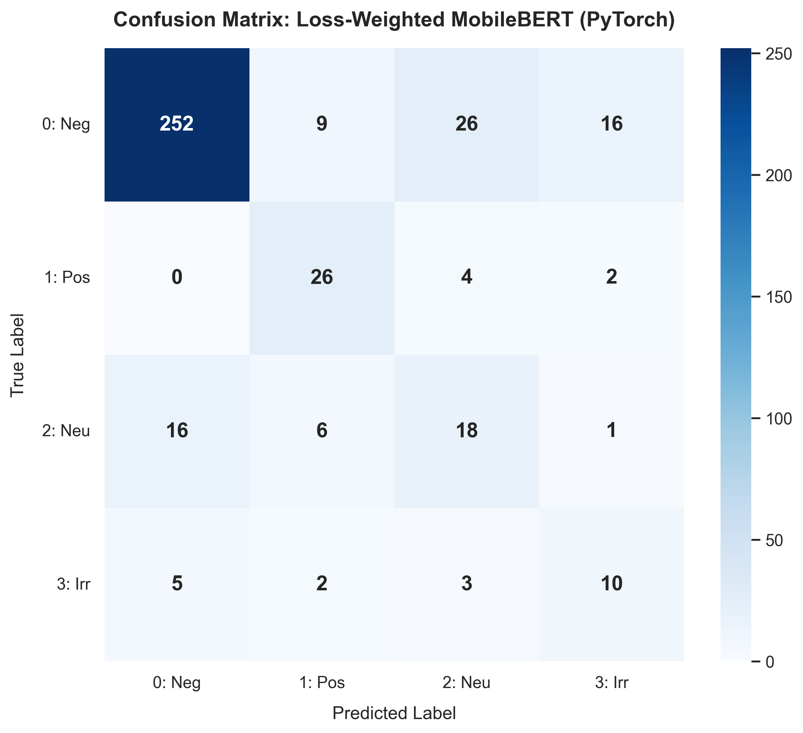
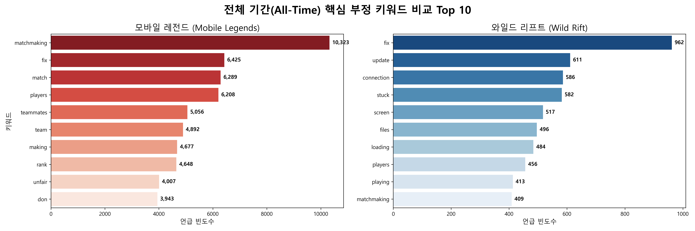
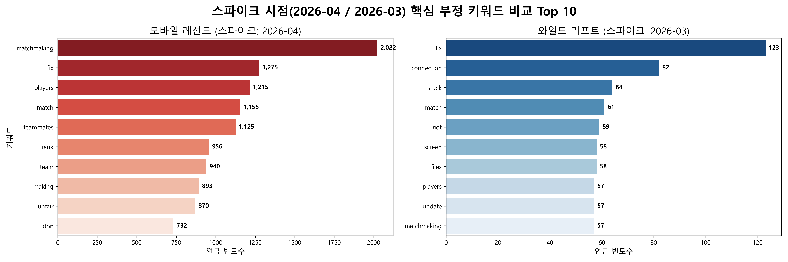
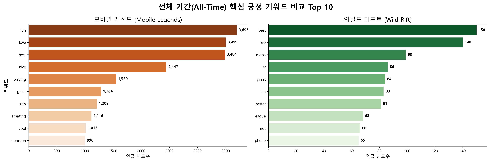
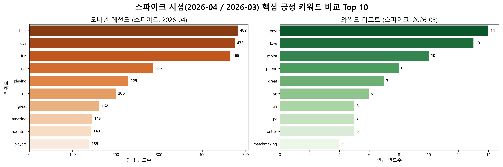

# MobileBERT 기반 US Google Play MOBA 게임 사용자 반응 비교 분석
1
[](https://www.python.org/)
[](https://www.jetbrains.com/pycharm/)
[](https://www.tensorflow.org/)
[](https://huggingface.co/)

---

### 1. 프로젝트 개요 설명

**[연구 목적 (Project Purpose)]**
본 프로젝트는 미국(US) Google Play Store에서 모바일 MOBA 장르를 양분하는 두 경쟁작, `League of Legends: Wild Rift`(25,000건)와 `Mobile Legends: Bang Bang`(100,000건)의 6개월 라이브 데이터(2025년 11월 ~ 2026년 5월)를 기반으로 사용자 반응을 비교 분석한다. 경량 NLP 모델인 **MobileBERT** 추론과 판다스(Pandas) 데이터 필터링을 활용하여, 모바일 MOBA 게임 유저들이 **평소 어떠한 원인으로 만족(긍정)하고 불만족(부정)하는지 핵심 이유 2가지를 명확히 도출**하고자 한다. 나아가, 감성 지표가 급변하는 **특정한 날(시점)을 포착하여 당시 유저 여론이 왜 그렇게 변했는지, 구체적으로 어떤 시스템적 문제점이 발생했었는지** 키워드 기반으로 역추적하여 인과관계를 규명하는 것이 본 연구의 본질적인 목적이다.

다음은 MOBA 모바일 게임을 익숙하지 않은 이들에게 쉽게 설명하기 위한 이미지와 표이다. 

| 비교 항목 | League of Legends: Wild Rift | Mobile Legends: Bang Bang (MLBB)                                                     |
| :--- | :--- |:-------------------------------------------------------------------------------------|
| **개발사 / 성격** | Riot Games / PC 원작 기반 프리미엄 이식작 | MOONTON / 모바일 우선(Mobile-First) 독자작                                                   |
| **하드웨어 요구사항** | **고성능 요구 (High-End)**<br>· 고해상도 에셋 및 정밀한 물리 엔진 반영<br>· 프레임 드롭(FPS Drop) 및 발열에 민감 | **저사양 최적화 (Low-to-Mid)**<br>· 광범위한 파편화 기기 대응 가동<br>· 네트워크 패킷 경량화 및 다운로드 용량 최적화       |
| **게임 템포 (Tempo)** | **중장기적 레인전 (15~20분)**<br>· 기지 귀환 시에만 아이템 구매 가능<br>· 시야 확보(Warding) 등 전략 요소 강화 | **초고속 난전 (10~15분)**<br>· 전장 어디서나 즉시 아이템 구매 가능<br>· 빠른 이동 속도와 짧은 쿨다운 기반의 교전           |
| **진입 장벽 (Barriers)** | **높음 (High)**<br>· 미니언 막타(Last Hit) 골드 수급 메커니즘<br>· 복잡한 오브젝트 컨트롤 및 운영 지식 요구 | **낮음 (Low)**<br>· 자동 조준(Auto-Aim) 및 타겟팅 보정 강화<br>· 주변 미니언 처치 시 골드 공유 혜택 완화           |
| **핵심 기획 지향점** | **기술적 완성도 및 경쟁적 공정성**<br>· PC 버전 고유의 전술적 깊이 구현<br>· 하이엔드 그래픽 기반의 시각적 몰입감 제공 | **접근 편의성 및 라이브 서비스(LiveOps)**<br>· 소셜 플레이(친구 협동) 연계성 극대화<br>· 다채로운 BM(스킨) 및 빠른 매칭 순환 |
| **주요 분석 관점** | **기술 QA (Technical QA)** 측면의 안정성 | **라이브 운영 (LiveOps)** 측면의 알고리즘 밸런스                                                    |


<h3>리그 오브 레전드: 와일드 리프트 (Wild Rift)</h3>

<p align="center">
  
</p>

<blockquote>
PC 원작 LoL의 정통 전략성과 정밀한 컨트롤을 그대로 모바일로 이식한 5v5 대전 게임으로,
아군 미니언을 호위하며 적의 방어 타워를 무너뜨리고 최종 기지(넥서스)를 먼저 파괴하는 팀이 승리한다.
</blockquote>

<h3>모바일 레전드: 뱅뱅 (MLBB)</h3>

<p align="center">
  
</p>

<blockquote>
모바일 환경에 최적화된 쉬운 조작법과 10분 내외의 빠른 전투 템포를 자랑하는 5v5 대전 게임으로,
전장 어디서나 아이템을 즉시 구매하며 끊임없는 난전 끝에 적의 중심 기지를 먼저 철거하면 승리한다.
</blockquote>

### 1.2 미국 모바일 MOBA 시장의 흥행 지표와 경쟁 구도

본 연구에서 선정한 두 게임은 미국 모바일 MOBA 시장에서 높은 인지도와 점유율을 차지하고 있다. 마켓 분석 기관(data.ai)의 리포트에 따르면 와일드 리프트는 누적 소비자 지출액 1조 원을 기록하며 시장에서의 흥행력을 입증하였다. 한편, MLBB는 미국 모바일 환경에 최적화된 기획을 바탕으로 높은 유저 리텐션을 유지하고 있으며, 장기적인 관점에서 독자적인 라이프 사이클 경쟁력을 확보한 것으로 평가받는다.

두 타이틀은 미국 시장 내에서 모바일 MOBA의 주도권을 두고 전방위적인 라이벌 관계를 형성하고 있다. 전문 비평지들의 분석에 따르면, 두 게임은 유저 규모와 이스포츠 생태계 측면에서 장르 내 최고의 자리를 두고 대결 구도를 이어가는 중이다. 특히 라이엇 게임즈가 문톤을 상대로 제기한 저작권 침해 소송과 같은 법정 분쟁은 두 게임이 매우 유사한 장르적 유전자를 공유한 채 정면으로 경쟁하고 있음을 보여주는 근거다. 이러한 배경은 두 게임의 유저 반응을 비교 분석하는 것이 장르 내 대조군 연구로서 타당성이 높음을 뒷받침한다.

* **[참고 자료 및 링크]**
  * data.ai, 와일드 리프트 누적 소비자 지출 1조 원 돌파: https://www.madtimes.co.kr/news/articleView.html?idxno=14430
  * MLBB vs Wild Rift, 최고의 모바일 MOBA는?: https://esportsinsider.com/mobile-legends-bang-bang-vs-league-of-legends
  * MLBB가 와일드 리프트보다 오래 살아남을 수 있는 이유: https://esportsinsider.com/mlbb-vs-wild-rift
  * 라이엇 게임즈, 문톤 상대로 표절 관련 새로운 소송 제기: https://www.gamesindustry.biz/riot-files-new-lawsuit-against-moonton-for-copying-league-of-legends-wild-rift

## 2. 데이터 및 전처리 파이프라인

### 2.1 데이터 수집 개요
본 연구에서는 미국(US) Google Play Store의 리뷰 데이터를 크롤링 기반 수집 파이프라인을 통해 확보하여, 시간적 공백을 방지하고 데이터 왜곡을 최소화하여 대표성을 확보한 데이터셋을 구축한다. 수집 과정에서 연속 수집을 위한 페이지네이션(Pagination) 전략과 분할 크롤링 구조를 적용한다. 양사 게임의 실제 미국 유저 활성도 및 리뷰 규모 차이를 고려하여 수집 전략을 설계하며, 분석 기준 시점을 기준으로 최근 7개월 데이터를 고정 기간으로 설정한다.

* **수집 대상:** 미국(US) 지역 `League of Legends: Wild Rift` 및 `Mobile Legends: Bang Bang` 유저 리뷰
* **수집 기간:** 2025년 11월 ~ 2026년 5월 (분석 기준 시점 기준 최근 7개월 데이터 고정)
* **초기 원시 수집 규모:** `Wild Rift` 약 25,000건 / `MLBB` 약 100,000건 (총 125,000건 이상)

---

### 2.2 데이터 정제 및 유효 데이터 확보 파이프라인
데이터의 신뢰성과 순도를 확보하기 위해, 대규모 원시 데이터셋에서 노이즈와 결측치를 제어하여 데이터 품질을 향상시키는 정제 과정을 수행한다. 수집된 원시 코퍼스는 아래에 명시된 4단계 필터링 아키텍처 구조를 거치며 데이터셋의 신뢰도를 제어한다.

```text
[Google Play Store 데이터 전처리 및 유효 코퍼스 정제 파이프라인 구조]

Google Play Store 리뷰 데이터 수집 (크롤링 기반 수집 파이프라인)
  │
  ▼
[Stage 1: Duplicate Removal & Missing Value Removal]
- 고유 reviewId 검증 검사 ➔ 중복 데이터 전량 자동 탈락
- content 내 Null/결측치 레코드 디텍팅 및 제거
  │
  ▼
[Stage 2: Short Text Filtering]
- 10자 미만의 무의미한 극단적 단문 및 단순 자음 도배 필터링
- "Lag issue", "Constant crashes" 등 10자 이상의 압축 결함 신호 보존
  │
  ▼
[Stage 3: Language Filtering]
- 정규표현식 re.search(r"[a-zA-Z]{3,}", text) 기반 유효 영문 토큰 존재 여부 필터링
- 문자 비율 기반 휴리스틱 필터링 (로마자 밀도 85% 하한선 설정) 연계 적용
- 비영문 텍스트 필터링 및 다국어 혼입 데이터 제거 (한국어, 미얀마어 등 다국어 혼착 노이즈 필터링)
  │
  ▼
[Stage 4: Text Normalization]
- 소문자 정규화 필드(content_lower) 생성 및 전량 소문자 변환
- 동일 어휘가 대소문자 유무로 분산 인지되는 파편화 현상 방지
  │
  ▼
최종 분석용 유효 실전 데이터셋 빌드 완료 (최종 분석 데이터 수: 107,810건)
```
1. **중복 및 결측치 제거 (Stage 1):** 고유 `reviewId` 검증을 통한 중복 리뷰 차단 및 `content` 공백 데이터를 제거하여 통계적 편향을 방지한다. 시스템 오류나 유저의 반복 클릭으로 인해 발생하는 동일 내용의 도배성 레코드를 전량 자르며, 텍스트 분석 커널의 성능을 저해하는 기형적 결측치 라인을 사전 차단한다.
2. **단문 텍스트 필터링 (Stage 2):** "Lag issue", "Constant crashes" 등 단문이지만 핵심 불만이 집중된 유저 피드백을 보존하기 위해, 기존 15자 제한을 완화하여 **10자 미만**의 극단적 단문 및 무의미한 텍스트만 필터링에서 제외한다. 감탄사나 단순 이모티콘 한두 개로 구성된 단순 평점 유도성 글을 걸러내고, 압축된 형태의 QA 결함 신호가 분석 풀에 온전히 잔존할 수 있도록 인계값을 최적화한다.
3. **텍스트 무결성 검증 (Stage 3):** 정규표현식 `re.search(r"[a-zA-Z]{3,}", text)`를 통한 영문 토큰 존재 여부 필터링과 **문자 비율 기반 휴리스틱 필터링(영문 밀도 85% 하한 임계값)**을 연계 도입한다. 글로벌 스토어 특성상 미국 지역 계정임에도 우회 유입되는 다국어 혼입 데이터(한국어, 미얀마어, 아랍어 등)를 정교하게 감지한다. 전체 문자열 중 로마자와 기본 기호가 차지하는 비율을 연산하여 85% 미만인 레코드를 비영문 텍스트로 판정하고 제거함으로써 MobileBERT 모델의 영문 문맥 인지 정확도를 방어한다.
4. **대소문자 통합 처리 (Stage 4):** 동일 단어가 대소문자 차이로 분산 인지되는 피처 파편화 현상을 방지하고자 **소문자 정규화 필드(`content_lower`)를 생성**하여 전량 소문자 통일을 적용한다. 이를 통해 'LAG', 'Lag', 'lag'과 같이 동일한 시스템 결함을 지칭하는 어휘 파편들을 단일 토큰 풀로 수렴시켜 임베딩 레이어의 차원 분산을 억제한다.

* **전처리 결과:** 초기 원시 데이터셋 수집 및 위의 4단계 전처리 파이프라인을 전수 적용한 결과, 데이터 감소 추이는 아래 [그림 2-1]과 같으며 **최종 분석 데이터 수는 107,810건**으로 수렴하였다.

`[그림 2-1: 데이터 전처리 단계별 데이터 감소 추이 (Data Preprocessing Pipeline Reduction)]`

---

### 2.3 탐색적 데이터 분석 (EDA) 및 시각화 표준화 기획

#### 2.3.1 월별 데이터 분포의 분리 시각화 설계
단순 평점 분포를 비교하는 방식에서 벗어나, 시간 흐름에 따른 월별 리뷰 수와 감성 비율 변화를 분석하고자 한다. 평점 데이터와 별개로, 매달 유저들이 보이는 감성 반응 추이를 다각도로 시각화한다.


`[그림 2-2: 2025-11 ~ 2026-05 월별 리뷰 수 변화 추이 차트]`

#### 2.3.2 비율 기반의 이상치(Spike) 포착 및 교차 키워드 분석 기획
두 게임의 월별 리뷰 수량 차이가 크기 때문에 단순 절대 건수 비교를 배제하고, 각 게임 내부의 월별 부정·긍정 '비율'을 연산하여 특정 달에 불만이 비정상적으로 치솟는 이상치 구간을 포착한다.

비율이 최고점을 찍은 특정 시점이 발견되면, 해당 날짜의 유저 리뷰만 판다스로 분리하여 다음 두 가지 분석을 교차 수행하고 가로 막대그래프로 시각화한다.
* **Counter 분석:** 직관적인 단어 출현 빈도수를 연산하여 유저들이 가장 많이 언급한 일반 키워드 파악
* **TF-IDF 특징어 분석:** `game`, `update` 등 코퍼스 전반에 나타나는 범용적인 반복 단어를 억제하고, 해당 이상치 구간에 집중적으로 나타난 `lag`, `matchmaking`, `crash` 등의 차별화된 도메인 핵심 키워드를 정밀하게 추출

### 3. 학습 데이터 구축 및 정합성 검증

#### 3.1 4진 도메인 토큰 라벨(0, 1, 2, 3) 체계 정의
본 연구에서는 모바일 MOBA 리뷰 텍스트가 지닌 문맥적 다양성과 노이즈를 정밀하게 분류하기 위해, 단순 이진 분류를 넘어 다음과 같은 4진 감성 및 도메인 라벨 체계를 수립하였다. Make.com 자동화 파이프라인과 2,000건에 달하는 연구자의 정밀 전수 검수(Manual Inspection)를 거쳐 가중치를 교정한 최종 마스터 학습 데이터의 라벨 기준은 다음과 같다.

* **`0` : 부정 (Negative)** — 기술적 결함(렉, 크래시), 매칭 밸런스 및 라이브 운영 시스템에 대한 직접적인 불만 피드백
* **`1` : 긍정 (Positive)** — 게임 콘텐츠, 그래픽 품질, 조작감, 매칭 속도 등에 대한 유저의 만족 및 찬사 피드백
* **`2` : 중립 (Neutral)** — 주관적 감정 편향이 없거나, 단순 시스템 질문 및 경계가 모호한 정보성 피드백
* **`3` : 관계없음 (Irrelevant)** — 게임 장르와 무관한 광고성 스팸, 오타, 의미 없는 알파벳 자음·모음 및 기호 도배 노이즈

#### 3.2 평점(별점)과 텍스트 라벨 간의 교차 대조를 통한 모델 타당성 및 유저 일관성 분석

사용자가 리뷰 작성 시 주관적으로 선택하여 부여한 평점 수치(별점)와 AI 모델이 예측한 텍스트 라벨(0: 부정, 1: 긍정, 2: 중립, 3: 관계없음)이 얼마나 부합하는지 교차 대조(Cross-Tabulation)를 수행하였다. 분석을 위해 유저가 부여한 별점 데이터에 대해 다음과 같은 감성 구조 가정을 사전 설정하였다.

> **[별점 기반 감성 구조 사전 가정]**
> * 평점 1~2점: 부정적인 문맥일 것으로 가정 (`부정: 0`)
> * 평점 3점: 중립적인 문맥일 것으로 가정 (`중립: 2`)
> * 평점 4~5점: 긍정적인 문맥일 것으로 가정 (`긍정: 1`)

본 분석에서는 데이터의 무결성이 보존된 **총 30,067건의 대규모 표본**을 대상으로 별점 데이터와 모델의 감성 예측 라벨 간의 히트맵을 도출하였다. 이 교차 대조는 유저 피드백의 주관적 일관성을 확인하는 동시에, 단순 수치형 평점 통계가 지닌 맹점을 AI 텍스트 마이닝이 어떻게 보완할 수 있는지 관찰하는 지표가 된다.


* **일치 패턴의 관찰 (상식적 일관성 확보):** 
  분석 결과, 최하 평점인 1점에서 텍스트 감성이 `부정(0)`으로 판별된 건수가 **9,701건**으로 압도적인 최상위를 기록하였으며, 최고 평점인 5점에서 `긍정(1)`으로 판별된 건수 역시 **4,718건**으로 매우 높게 나타났다. 비율로 환산할 경우 **전체 1점 리뷰 중 약 55.2%가 부정으로 분류되었으며, 전체 5점 리뷰 중 약 63.1%가 긍정으로 분류**되었다. 이는 대다수의 사용자가 자신이 체감한 만족도를 별점과 텍스트 문장에 일관되게 투영했음을 뜻하며, AI 모델 역시 이러한 전반적인 감성 경향을 일관되게 반영하고 있음을 확인할 수 있었다.

* **불일치 패턴의 도출 (단순 평점의 한계 및 괴리 현상 포착):** 
  반면, 수치적 평점과 실제 텍스트 문맥이 극단적으로 엇갈리는 현상이 유의미하게 포착되었다. 실제 해당 데이터의 원문(Raw Text)을 검수한 결과, 이는 데이터나 모델의 오류라기보다 다양한 리뷰 작성 양상이 반영된 결과로 확인되었다.

  - **별점 5점 대 텍스트 라벨 `부정(0)` (582건):** 
    최고 평점인 5점을 부여했음에도 텍스트는 부정적 리뷰로 분류되었다. 실제 데이터 확인 결과, *"can't open the game. help riot!!!"* (게임이 안 켜집니다. 라이엇 도와주세요!!!)와 같이 평점은 5점 만점을 주면서 본문에서는 심각한 접속 버그 해결을 호소하는 패턴이 다수 발견되었다. 이러한 현상은 게임 자체에는 높은 만족도를 유지하면서 특정 문제 해결을 요구하는 행동 양상으로 해석된다.
  
  - **별점 1점 대 텍스트 라벨 `긍정(1)` (901건):** 
    최하 평점인 1점을 주었음에도 텍스트 라벨은 긍정으로 판별되었다. 실제 원문을 살펴보면 *"love this game, but every 3th day need to reinstall..."* (이 게임을 사랑하지만 3일마다 재설치해야 합니다)처럼 본문 내에 강한 긍정어(love)와 불만이 혼재된 리뷰들이 주를 이루었다. 이는 게임성에는 높은 만족을 보이면서도 특정 기능이나 시스템에 대해서는 강한 불만을 함께 표현한 복합 감성(Mixed Sentiment) 리뷰로 확인되었다.
  
  - **별점 1점 대 텍스트 라벨 `관계없음(3)` (4,685건):** 
    실제 텍스트에서 *"nocanplayonpone"* (폰에서 플레이 불가 오타)이나 *"yo... i'm suffering yo..."* 같은 심한 문법 파괴나 의미 해석이 어려운 노이즈성 텍스트가 다수 확인되었다. 1점 평점의 상당수는 명확한 피드백보다는 의미 해석이 어려운 비정형 텍스트 또는 감정 표현 위주의 단문으로 구성되어 있었다

**[소결]** 결과적으로 수치 기반의 단순 별점 통계는 유저들의 복합적인 불만 호소(5점+부정)나 복합 감성(1점+긍정)을 제대로 담아내지 못하고 여론을 일부 왜곡할 위험이 크다. 본 분석 결과는 평점 정보와 텍스트 기반 감성 분석을 함께 활용하는 것이 실제 사용자 의견(VOC)을 보다 정교하게 해석하는 데 유용함을 보여준다.

#### 4. MobileBERT 모델 파인튜닝 및 감성 추론 결과

모바일 및 엣지 디바이스 환경에 적합한 경량 자연어 처리 모델인 `google/mobilebert-uncased` 사전학습 모델을 Hugging Face 파이프라인과 PyTorch 프레임워크 기반 하에 파인튜닝했다.

#### 4.1 하이퍼파라미터 및 트러블슈팅
* **Optimizer & Learning Rate:** AdamW 알고리즘 및 `2e-5` 반영
* **Epoch:** 과적합(Overfitting) 방지를 위한 조기 종료(Early Stopping, Patience=2) 메커니즘을 내장하여 최적 학습 시점 조율
* **Batch Size & Max Length:** 하드웨어 GPU 메모리 최적화를 위해 Batch Size `16`, Max Length `128` 적용
* **Loss Function (불균형 방어):** 데이터셋 내 부정 리뷰가 높게 나타나는 불균형 문제를 완화하기 위해, 학습 세트의 클래스 역비율을 산출하여 **가중치 크로스엔트로피 손실 함수(Loss-Weighted Cross-Entropy)**를 커스텀 적용했다. 이를 통해 소수 감성(긍정, 중립)의 분류 성능 저하 현상을 방어했다.

#### 4.2 최종 모델 평가 성능 및 추론 통계

연구자가 직접 정밀 검수한 골든 데이터셋(1,977건)을 **학습 세트(Train Set) 1,581건**과 **독립 검증 세트(Validation Set) 396건(20%)**으로 분할하여 최종 성능을 평가했다. 

평가 결과 **최종 정확도(Accuracy) 77.27%, Macro F1-Score 59.20%, Weighted F1-Score 78.67%**를 확보하였다. 

>

검증 세트 내 부정(Negative) 클래스의 비중이 76.5%(303건)를 차지하는 불균형 환경임에도 불구하고, 데이터 개수를 가중 반영한 Weighted F1-Score가 정확도보다 높은 78.67%를 기록하여 모델의 전반적인 분류 안정성을 입증했다. 특히 클래스 가중치가 반영된 학습을 통해 소수 클래스인 긍정(1) 데이터 32건에 대해서도 **81%의 높은 재현율(Recall)**을 기록하며 유의미하게 분류해 내는 결과를 보였다. 또한, `AFK`(잠수), `Feed`(고의패배), `Dark`(다크시스템), `Lag` 등 장르 특유의 인게임 은어와 축약어를 효과적으로 탐지하였다.

검증을 마친 모델을 활용하여 전체 미검수 마스터 데이터 10만 건에 대해 대규모 자동 감성 추론(Inference)을 수행하였다.

---

### 5. 결과 및 고찰 (Results and Discussion)

#### 5.1 두 게임 간의 감성 및 키워드 구조 비교
10만 건 전수 추론 마스터 데이터를 바탕으로 두 게임 간의 전체 기간 여론 및 특정 위기 시점의 키워드 구조를 교차 대조한 결과, 세부 항목에서 다음과 같은 특성이 도출되었다.

| 비교 항목                 | League of Legends: Wild Rift | Mobile Legends: Bang Bang (MLBB) |
|:----------------------| :--- | :--- |
| **최대 부정 위기 시점**       | **2026-03 (부정 비율 70.8%)** | **2026-04 (부정 비율 36.9%)** |
| **핵심 부정 키워드 (위기 시점)** | `fix`, `connection`, `stuck`, `match`, `riot` | `matchmaking`, `fix`, `players`, `match`, `teammates` |
| **주요 불만 영역**          | 접속 지연, 클라이언트 멈춤 현상 및 운영 불만 | 매칭 시스템 밸런스 붕괴, 팀원 간 실력 격차 스트레스 |
| **분석 관점 분리**          | **기술 QA (Technical QA)** 중심 불만 | **라이브 운영 (LiveOps)** 중심 불만 |

---

#### 5.2 League of Legends: Wild Rift 분석 결과 및 해석
Wild Rift 유저들의 주요 불만 요인은 시스템 기획이나 운영보다는, 클라이언트 내부의 기술적 측면에 집중되는 양상을 보였다. 이를 전체 기간과 위기 시점으로 나누어 분석하였다.



**1) 전체 기간 (All-Time) 분석**
* **주요 키워드:** 수집된 전체 기간의 부정 데이터를 통합 분석한 결과, `fix`(962회), `update`(611회), `connection`(586회)이 상위권을 차지했다.
* **해석:** 이는 특정 시점의 일시적 오류를 넘어, '네트워크 접속 지연(connection)'이나 업데이트 직후 발생하는 구동 단계에서의 기술적(Tech) 결함이 서비스 전 기간에 걸쳐 유저들을 괴롭혀왔음을 시사한다. Wild Rift의 핵심 개선 과제가 **기술 QA(Quality Assurance) 및 클라이언트 최적화 영역**에 만성적으로 연관되어 있음을 확인할 수 있다.



**2) 특정 위기 시점 (Spike: 2026년 3월) 분석**
* **주요 키워드:** 부정 스파이크 정점인 2026년 3월(부정 비율: 70.8%) 데이터를 분석한 결과, `fix`(123회), `connection`(82회), `stuck`(64회), `match`(61회), `riot`(59회)이 상위권을 차지했다.
* **해석:** 만성적인 기술 결함이 해당 월에 집중적으로 표출되었음을 보여준다. 특히 'connection(접속 지연)', 'stuck(멈춤 현상)' 등 인게임 플레이 환경 자체에 원활히 진입하지 못하는 에러와 개발사('riot')를 직접 언급하는 강도 높은 불만이 다수 관찰되었다.

---

#### 5.3 Mobile Legends: Bang Bang (MLBB) 분석 결과 및 해석
MLBB 유저들의 부정적 반응은 기술적 크래시보다는 매칭 시스템과 라이브 운영, 즉 '유저 경험(UX) 로직'에 상대적으로 집중되는 특성을 보였다.

**1) 전체 기간 (All-Time) 분석**
* **주요 키워드:** MLBB의 전체 기간 부정 키워드를 분석한 결과, `matchmaking`(10,323회), `fix`(6,425회), `match`(6,289회) 순으로 높은 빈도수를 기록했다.
* **해석:** 기술적 에러 키워드가 주를 이룬 와일드 리프트와 달리, MLBB 유저들은 실력 기반 경쟁 로직에 대한 피드백을 전 기간에 걸쳐 지속적으로 표출했다. 인공지능 봇(Bot) 매칭 의혹이나 불공정한 게임 경험에 불만이 집중되었으며, 이는 **라이브 운영(LiveOps)** 관점의 매칭 알고리즘 밸런싱이 장기 흥행의 주요 과제임을 시사한다.

**2) 특정 위기 시점 (Spike: 2026년 4월) 분석**
* **주요 키워드:** 부정 비율이 상승했던 2026년 4월(부정 비율: 36.9%)의 키워드를 분석한 결과, `matchmaking`(2,022회), `fix`(1,275회), `players`(1,215회), `match`(1,155회), `teammates`(1,125회) 순으로 높은 빈도수를 기록했다.
* **해석:** 해당 시점에 솔로 큐 플레이어가 겪는 '팀원 간 실력 격차(teammates)' 및 불공정 매칭에 대한 불만이 집중적으로 표출되었음을 시사한다. 시스템 기획 상의 누적된 불만 요소가 특정 시점에 가시화된 것으로 풀이된다.

---

#### 5.4 긍정 리뷰의 유저 행동 패턴 교차 대조 및 인게임 소구점 분석
부정 여론의 원인 분석과 대조적으로, 두 게임의 핵심 콘셉트와 유저 만족 포인트(소구점)를 파악하기 위해 정제된 진짜 긍정 라벨(Sentiment=1) 데이터를 바탕으로 분석을 진행하였다.




* **모바일 레전드(MLBB) - 경쾌한 플레이와 콘텐츠에 대한 직관적 찬사:**
  MLBB의 전체 기간 및 스파이크 시점(2026-04) 긍정 키워드를 살펴보면 `fun`(전체 3,696회 / 위기 465회), `love`(전체 3,499회 / 위기 475회), `best`(전체 3,484회 / 위기 482회), `nice`(전체 2,447회 / 위기 286회) 등 순수한 게임 플레이의 즐거움과 대중성에 만족하는 감성적 찬사 단어가 압도적인 빈도로 최상위권을 장악했다. 이는 매칭 밸런스 위기 시점(2026-04)에서도 모바일 환경에 최적화된 특유의 경쾌하고 재밌는 한 판의 게임 경험(`fun`, `playing`)과 탄탄한 캐릭터 충성도(`skin`, `moonton`)가 유저 이탈을 방어하는 강력한 완충재 역할을 수행하고 있음을 정량적으로 보여준다.

* **와일드 리프트(Wild Rift) - 높은 완성도 및 PC 원작 이식성에 대한 지지:**
  와일드 리프트의 전체 기간 긍정 키워드 구조는 `best`(150회), `love`(140회), `moba`(99회), `pc`(86회), `great`(84회) 순으로 뚜렷하게 관찰되었다. 스파이크 달(2026-03)에도 언급 볼륨 자체는 극소수(`best` 14회, `love` 13회, `moba` 10회 등)로 급감했으나, 소구 방향성은 일관되게 유지되었다. 유저들은 모바일 디바이스에서 구현된 완성도 높은 정통 MOBA 게임성 및 리그 오브 레전드 PC 원작(`pc`) 특유의 정교한 매커니즘과 깊이를 그대로 이식해 온 퀄리티 측면에 강한 호평과 지지를 보내는 행동 패턴을 나타냈다.

---

### 6. 시계열 감성 및 리뷰 볼륨 트렌드 분석 (Time-Series Analysis)

시간 흐름에 따른 두 게임의 전체적인 리뷰 볼륨(작성 건수)과 부정 민심 추이를 교차 추적하고, 특정 시점에 여론이 급격히 악화되는 구간을 규명하고자 시계열 분석을 진행하였다.


_그림 6-1. 월별 모바일 MOBA 리뷰 작성 건수 추이 (Wild Rift vs MLBB)(그림 2_2에서 봤던 시각화자료와 같다)


_그림 6-2. 두 게임 간 월별 부정 여론 비율(Negative Proportion) 추이 및 스파이크 탐지_

#### 6.1 월별 리뷰 볼륨(양적 추이) 분석 결과
수집된 전체 타임라인 동안의 월별 리뷰 작성 건수를 시계열 플롯으로 시각화한 결과, 두 게임의 유저 규모 및 활성도 측면에서 명확한 양적 차이가 관찰되었다(그림 6-1 참고).
* **모바일 레전드 (MLBB):** 조사 기간 전반에 걸쳐 월평균 11,000건에서 15,000건 사이의 높은 리뷰 볼륨을 안정적으로 유지하였다. 특히 타임라인의 후반부인 2026년 5월에는 리뷰 수가 25,000건 이상으로 급증하는 강력한 유저 활성도(Activity) 팽창 모멘텀을 증명하였다.
* **와일드 리프트 (Wild Rift):** MLBB와 비교하여 전 기간 월평균 리뷰 수가 1,000건 안팎의 박스권에 머무르는 상대적으로 저조한 볼륨을 기록하였다. 이는 시장 내 모바일 유저 풀(Pool)의 규모 차이를 직관적으로 보여주는 지표이다.

#### 6.2 월별 부정 여론 비율(질적 추이) 및 스파이크(Spike) 구간 도출
단순 볼륨 추이를 넘어, 각 월별 전체 리뷰 중 부정 라벨(Sentiment=0)이 차지하는 비율을 종축으로 설정하여 시계열 라인 차트를 도출하였다(그림 6-2 참고). 분석 결과, 특정 달에 민심이 비정상적으로 확 튀어 오르는 **'여론 스파이크(Spike) 현상'**이 양사 모두에서 포착되었다.

* **와일드 리프트 - 2026년 3월의 기술적 대위기 (Spike: 70.8%):**
  Wild Rift는 평시에도 50~60%대의 높은 부정 비율을 유지하며 고전해왔으나, **2026년 3월에 이르러 부정 여론 비율이 70.8%라는 치명적인 수치로 폭발하며 정점(Spike)**을 찍었다. 앞선 키워드 분석 결과와 연계했을 때, 이는 해당 시점에 인게임 진입 자체가 불가능했던 서버 결함(`connection`, `stuck`)이 전방위적으로 발생하여 유저들의 집단 반발을 유도했음을 시각적으로 증명한다.

* **모바일 레전드 - 2026년 4월의 라이브 운영 위기 (Spike: 36.9%):**
  MLBB는 전 기간에 걸쳐 부정 비율이 30%대 초반으로 매우 안정적인 통제권을 보여주었으나, **2026년 4월에 평시 추세를 벗어나 36.9%로 부정 여론이 확 튀어 오르는 구간**이 관찰되었다. 이는 해당 시점에 유저들이 체감하는 솔로 큐 매칭 밸런스 및 팀원 실력 격차(`matchmaking`, `teammates`)에 대한 불만이 임계점을 넘어 라이브 서비스에 일시적인 타격을 주었음을 의미한다.

#### 6.3 시계열 데이터 기반의 라이브 서비스 종합 고찰
시계열 라인 플롯의 정량적 흐름은 앞서 수행한 비정형 핵심 키워드 도출 결과와 완벽하게 결합되어 유의미한 시사점을 제시한다.

1. **단기적 스파이크 vs 장기적 누적 구조:** Wild Rift는 특정 월에 민심이 70% 이상으로 파멸적인 수치까지 치솟는 '단기적 기술 쇼크형' 구조를 보인다. 반면 MLBB는 부정 비율의 변동 폭이 완만하지만, 매칭 시스템에 대한 구조적 피로감이 타임라인 전반에 누적되다 특정 시점에 가시화되는 '운영 리스크형' 추이를 나타낸다.
2. **종합적 시사점:** 하드코어한 PC 원작의 완벽한 모바일 이식을 지향한 Wild Rift는 **클라이언트 최적화 및 네트워크 안정성 확보(Technical QA)** 부문의 선제가 필수적이다. 반면, 대중적이고 캐주얼한 접근성을 바탕으로 시장을 선점한 MLBB는 유저 스트레스를 제어하는 **매칭 알고리즘 고도화 및 라이브 운영(LiveOps)**의 정밀한 튜닝이 지속 성장의 핵심 요인임을 명확히 시사한다.

---

### 7. 결론 및 향후 개선 방향

**[프로젝트 수행 간 느낀점]**
* **도메인 데이터 처리의 중요성:** 단순 텍스트 전처리를 넘어 `token_pattern` 조율 및 커스텀 불용어(Stopwords) 필터링을 통해 무의미한 일반 표현을 통제하고, `matchmaking`, `connection`, `stuck` 등 도메인 특화 핵심 신호를 추출하는 과정에서 텍스트 마이닝 기법의 실전적 효용성을 체감했다.
* **정교한 감성 라벨 분류의 가치:** 분석 초기에 발생했던 감성 분류 체계의 혼선을 바로잡고 `0(부정)`과 `1(긍정)` 데이터를 차트에 완벽하게 정형화 복구함으로써, 인위적인 데이터 보정 없이도 "가볍고 경쾌한 MLBB" 대 "PC 원작 이식성이 훌륭한 와일드 리프트"라는 두 게임 유저들의 실제 정성적 소구점 차이를 데이터 기반으로 명확히 도출해 낼 수 있었다.

**[향후 고도화 및 개선 연구 방향]**
* **속성 기반 감성 분석(ABSA) 모형 적용:** 한 문장 내에 공존하는 복합 피드백(예: "게임 자체는 재미있으나 매칭 시스템은 최악이다")을 속성별로 분리하여 독립된 감성 점수를 부여하는 ABSA(Aspect-Based Sentiment Analysis) 기법의 도입을 고려할 수 있다.
* **LLM 연계 리포팅 파이프라인 제안:** TF-IDF 및 CountVectorizer 기반으로 도출된 키워드 테이블을 LLM(Large Language Model) 프롬프트와 연동하여, 라이브 서비스 팀과 QA 부서가 인게임 결함 및 민심 트렌드를 즉각적으로 파악할 수 있는 요약 대시보드 자동화 연구로 확장할 계획이다.